# System Architecture — K-Scarcity / K-SHIELD / Institution Dashboards

---

## 1. Full System Data Flow

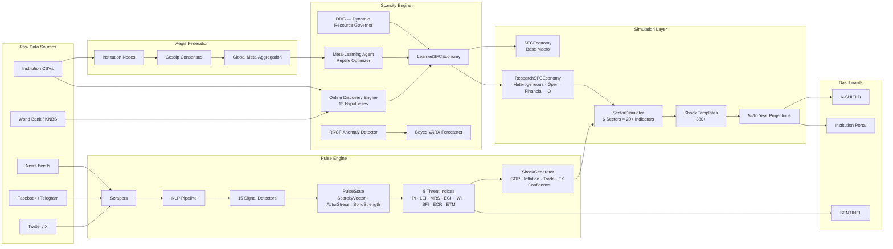

---

## 2. Pulse Engine — Signal Detection Pipeline

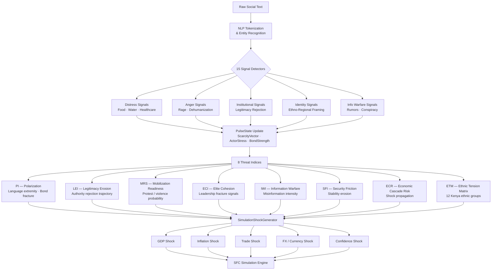

---

## 3. Scarcity Engine — Online Learning Architecture

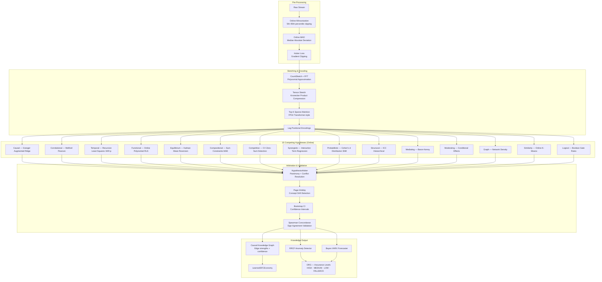

---

## 4. SFC Economy — Simulation Architecture

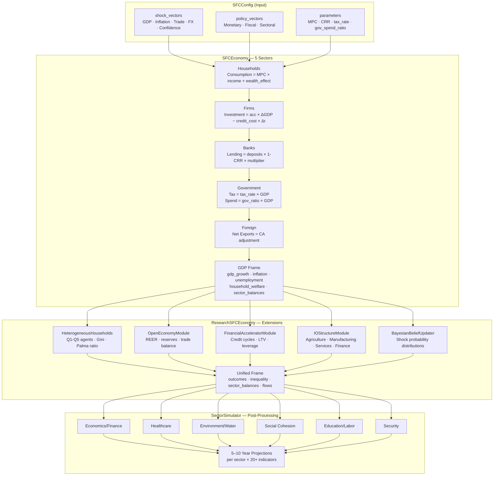

---

## 5. Aegis Federation Protocol

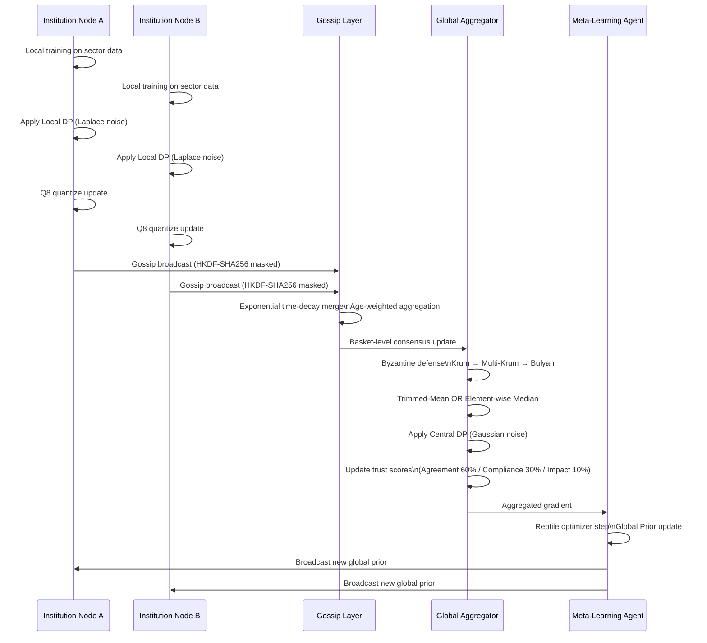

---

## 6. Institution Dashboard — Navigation Structure

```mermaid
flowchart TD
    L[Landing Page\n5 Ws — Who · What · When · Where · Why] --> A

    A[Institution Portal Login\nSector + Invite Code + Password] --> B{Role}

    B --> C[Executive Dashboard]
    B --> D[Admin Governance Console]
    B --> E[Developer Dashboard]
    B --> F[Local / Spoke Dashboard]

    C --> C1[National Briefing\nThreat Intelligence · Social Signals]
    C --> C2[Sector Reports\n7 Sectors — status grid always visible]
    C --> C3[Command & Control\nActive Operations]
    C --> C4[Policy Simulator\nScenario design + projections]
    C --> C5[Collaboration Room\nCross-institution messaging]
    C --> C6[Archive\nHistorical reports]
    C --> C7[Analytics Pillars\nSO WHAT · COMPARED TO WHAT · WHERE EXACTLY\nWHAT SHOULD I DO · DID IT WORK]

    D --> D1[Pending Approvals\nInstitution registration review]
    D --> D2[Audit Logs\nFull approval audit trail]
    D --> D3[Topology Injection\nLevel 1/2 agency hierarchy]
    D --> D4[FL Dashboard\nFederated learning round management]
    D --> D5[Admin Data Schemas\nStructured project tracking]

    E --> E1[Model Quality\nDRG assurance levels]
    E --> E2[Causal Adapter\nDiscovery engine inspection]
    E --> E3[Technical Metrics\nLatency · throughput · hypothesis counts]

    F --> F1[County Analytics\nLocalized indicators]
    F --> F2[Cost of Delay\nKES billions — Do Nothing · Act Early · Price of Late]
    F --> F3[Data Upload\nCSV → FL training trigger]
    F --> F4[Report Export\nPDF · ZIP · CSV]
```

---

## 7. K-SHIELD — Module Architecture

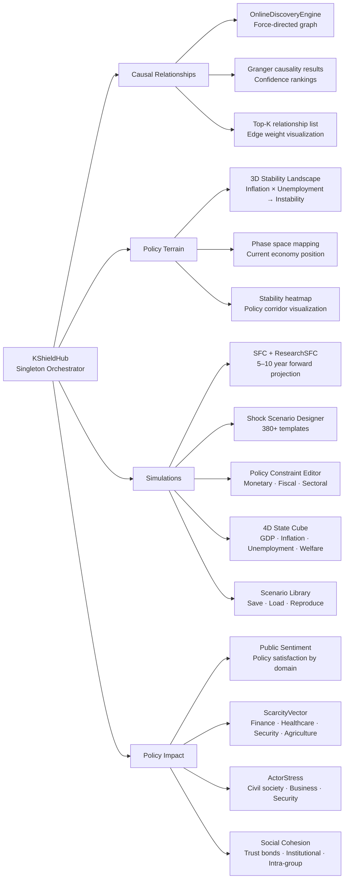

---

## 8. Report Export Pipeline

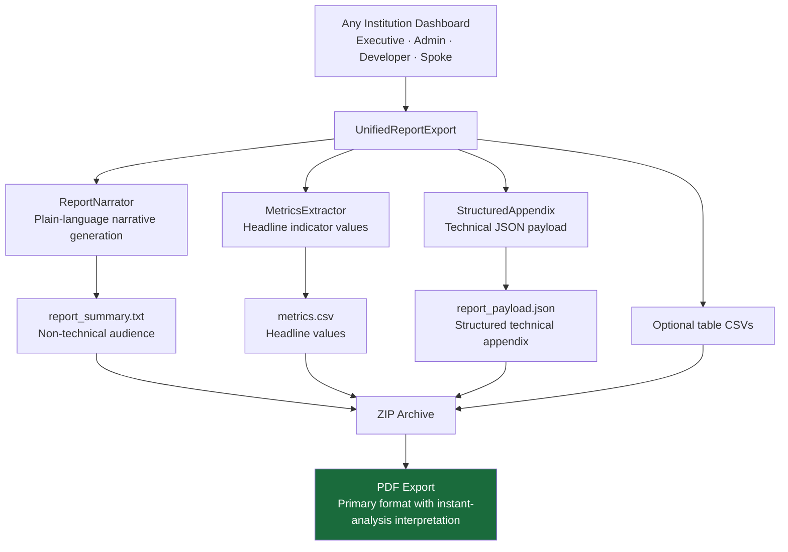

---

## 9. Cost of Delay Engine

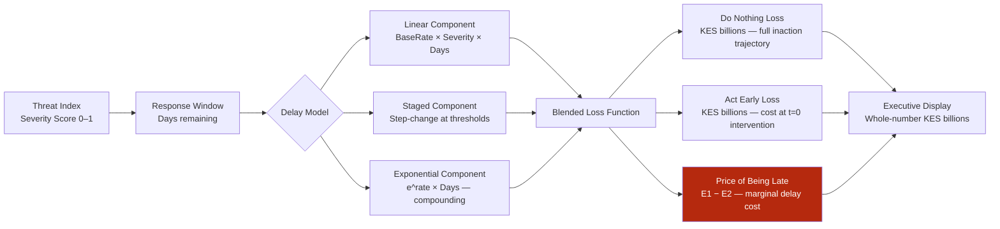

---

## 10. DRG Assurance Levels

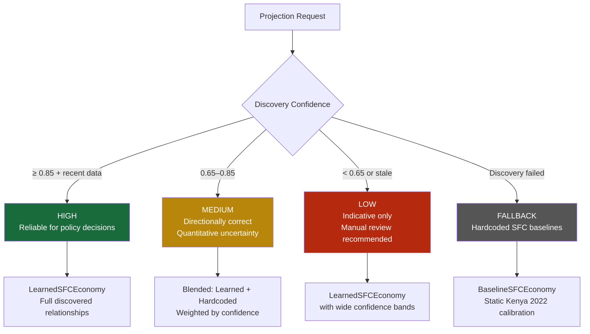

---

## 11. Component Interaction Map (Low-Level)

```
scarcity/engine/
┌──────────────────────────────────────────────────────────────────────┐
│  EventBus (runtime/bus.py)  — async pub/sub backbone                 │
│   "data_window"                ← new data row arrives                │
│   "scarcity.anomaly_detected"  → RRCF result                         │
│   "scarcity.forecasted_trends" → Bayes VARX result                   │
│   "scarcity.drg_extension_profile" → DRG risk profile                │
│                                                                      │
│  OnlineAnomalyDetector  (RRCF — streaming, no training phase)        │
│   Output: {anomaly_score: float, is_anomaly: bool, context: dict}    │
│                                                                      │
│  PredictiveForecaster  (GARCH-VARX — multi-variate + exogenous)      │
│   Output: {forecasts: List[float], variances, horizon}               │
│                                                                      │
│  OnlineDiscoveryEngine (engine_v2.py)                                 │
│   HypothesisPool → AdaptiveGrouper → HypothesisArbiter → MetaCtrl   │
│   .process_row(row) → update all hypotheses → arbitrate → promote    │
│   .get_knowledge_graph() → top-K confirmed relationships (JSON)      │
└──────────────────────────────────────────────────────────────────────┘

scarcity/simulation/
┌──────────────────────────────────────────────────────────────────────┐
│  SFCEconomy                                                          │
│   .step() → Consumption · Investment · Tax · Gov Spend · Net Exports │
│   .run(steps) → List[frame]                                          │
│   .apply_shock(type, magnitude)                                       │
│                                                                      │
│  ResearchSFCEconomy (wraps SFCEconomy)                               │
│   + HeterogeneousHouseholdEconomy (Q1–Q5 income quintiles)           │
│   + OpenEconomyModule (REER, reserves, trade balance)                │
│   + FinancialAcceleratorModule (credit cycles, LTV, leverage)        │
│   + IOStructureModule (agriculture, manufacturing, services, finance)│
│   + BayesianBeliefUpdater (shock probability distributions)          │
│   .stress_test(shocks) → shocked scenario outcomes                   │
│   .twin_deficit_analysis() → fiscal + current account positions      │
│   .external_vulnerability_index() → 0–1 reserve adequacy            │
│   .financial_stability_index() → 0–1 leverage + credit health       │
│                                                                      │
│  WhatIfManager                                                        │
│   .run_bootstrap(base_cfg, n=8, jitter_pct=8%)                       │
│   → (mean−std, mean+std) confidence interval tuple per dimension     │
└──────────────────────────────────────────────────────────────────────┘

kshiked/core/
┌──────────────────────────────────────────────────────────────────────┐
│  ScarcityBridge                                                       │
│   .train(data_path) → 306+ causal hypotheses from World Bank data    │
│   .create_learned_economy() → SFC with discovered relationships       │
│   .get_top_relationships(k) → ranked causal chains                   │
│   .get_confidence_map() → per-variable confidence scores (0–1)       │
│   .validate() → historical accuracy score + replay validation        │
│                                                                      │
│  EconomicGovernor                                                     │
│   Enforces resource stability constraints                            │
│   Transmits monetary/fiscal policy to SFC engine                     │
│                                                                      │
│  Shocks (Phase 4–5 Stochastic)                                        │
│   ImpulseShock      → exponential decay impulse                      │
│   OUProcessShock    → Ornstein-Uhlenbeck mean reversion              │
│   BrownianShock     → Geometric Brownian Motion                      │
│   MarkovSwitchingShock → Hamilton regime-switching                   │
│   JumpDiffusionShock → Poisson jump process                          │
│   StudentTShock     → fat-tailed shocks                              │
└──────────────────────────────────────────────────────────────────────┘

kshiked/federation/  (Aegis Protocol)
┌──────────────────────────────────────────────────────────────────────┐
│  AegisNode (extends FederationClientAgent)                           │
│   Security lattice: UNCLASSIFIED / RESTRICTED / SECRET / TOP_SECRET  │
│   Trust scoring per incoming packet                                   │
│   Graph merging from external nodes                                   │
│   CryptoSigner (Ed25519 signatures)                                   │
│                                                                      │
│  Cryptographic Secure Aggregation                                     │
│   Ed25519 long-term identity + X25519 ephemeral keys                 │
│   HKDF-SHA256 pairwise masking → summation cancellation              │
│   Q8 quantization before broadcast                                    │
│                                                                      │
│  Byzantine Defense Stack                                              │
│   1. Krum — reject outlier models by pairwise Euclidean distance      │
│   2. Multi-Krum — select k safest models                              │
│   3. Bulyan — Krum survivors → Trimmed-Mean (most hardened)          │
│   4. Coordinate-wise Trimmed Mean (top 10% + bottom 10% discarded)   │
└──────────────────────────────────────────────────────────────────────┘
```

---

## 12. Security Architecture

```mermaid
flowchart TD
    subgraph Clearance["Security Lattice"]
        L4[TOP_SECRET]
        L3[SECRET]
        L2[RESTRICTED]
        L1[UNCLASSIFIED]
        L4 --> L3 --> L2 --> L1
    end

    subgraph Auth["Authentication Layers"]
        A1[Institution: PBKDF2-SHA256\n200,000 iterations]
        A2[Module Access: SHA256 gate codes]
        A3[Federation: Ed25519 signatures]
        A4[Pairwise: HKDF-SHA256 masking]
    end

    subgraph Privacy["Privacy Guarantees"]
        P1[Local DP: Laplace noise on weights]
        P2[Central DP: Gaussian noise on aggregate\nσ = sensitivity × √2ln(1.25/δ) / ε]
        P3[Q8 quantization: economic precision preserved]
        P4[L2 materiality check: suppress trivial updates]
    end

    subgraph Trust["Trust Scoring"]
        T1[Agreement score: 60% weight]
        T2[Compliance score: 30% weight]
        T3[Impact score: 10% weight]
        T1 & T2 & T3 --> T4{Trust < 0.2?}
        T4 -->|Yes| T5[Sandboxed: packets accepted\nbut silently discarded]
        T4 -->|No| T6[Normal aggregation]
    end
```

---

## 13. Kenya Economic Baselines (KNBS / World Bank 2022)

| Sector | Indicator | Baseline |
|--------|-----------|---------|
| **Economics** | GDP Growth | 5.3% |
| **Economics** | Inflation | 7.6% |
| **Economics** | Unemployment | 5.5% |
| **Healthcare** | Capacity Utilization | 72% |
| **Healthcare** | Vaccination Coverage | 68% |
| **Healthcare** | Mortality Risk | 22% |
| **Environment** | Water Access | 62% |
| **Environment** | Drought Severity | 22% |
| **Environment** | Food Security | 68% |
| **Social** | Poverty Headcount | 36.5% |
| **Social** | Inequality (Gini-equivalent) | 38.6% |
| **Social** | Cohesion Index | 54% |
| **Education** | School Attendance | 83% |
| **Education** | Labor Productivity | 1.0 (index) |
| **Security** | Stability Index | 61% |
| **Security** | Conflict Risk | 28% |
| **Security** | Institutional Trust | 42% |

**Heterogeneous Household Calibration (Q1–Q5):**

| Quintile | Income Share | MPC | Formal Employment |
|----------|-------------|-----|------------------|
| Q1 (bottom 20%) | 4% | 0.95 | 10% |
| Q2 | 8% | 0.90 | 25% |
| Q3 | 12% | 0.85 | 45% |
| Q4 | 20% | 0.75 | 70% |
| Q5 (top 20%) | 56% | 0.60 | 90% |

---

## 14. Pulse Architecture Deep Dive — How It Calculates Everything

This section describes the Pulse system as an operational analytics pipeline: what it ingests, how it transforms raw signals, how each score is calculated, how uncertainty is handled, and how the final outputs are consumed by K-SHIELD and executive dashboards.

### 14.1 Design Goals

1. Convert noisy social and open-source signals into stable, decision-grade risk metrics.
2. Separate short-lived noise from persistent structural tension.
3. Produce interpretable indices that map to policy decisions and simulation shocks.
4. Keep the system robust to source outages, spam bursts, and coordinated manipulation.

### 14.2 End-to-End Pulse Computation Graph

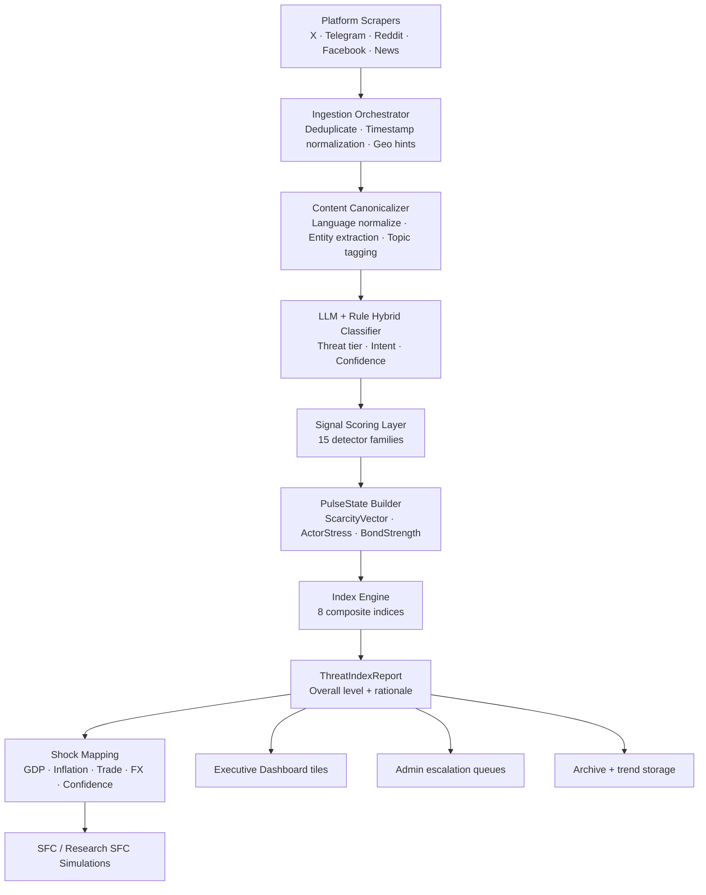

### 14.3 Runtime Component Interactions

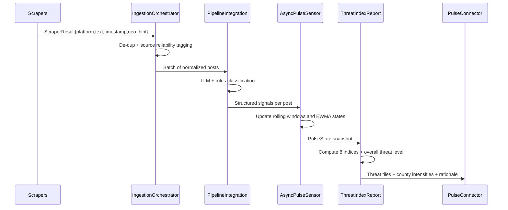

### 14.4 Data Contracts in Pulse

Incoming normalized signal unit:

1. Source metadata: platform, timestamp_utc, language, reliability weight.
2. Content fields: text, entities, topics, sentiment proxy, urgency markers.
3. Classification fields: threat category, confidence, intent label, geo scope.

PulseState snapshot:

1. ScarcityVector: stress by economic and social scarcity dimensions.
2. ActorStress: pressure estimates for state, market, civil, and local actors.
3. BondStrength: institutional trust and social cohesion proxies.
4. Velocity terms: first derivative of key tensions over recent windows.
5. Stability terms: rolling variance and agreement consistency across sources.

### 14.5 Core Calculation Stages

#### Stage A — Ingestion Quality Control

Each raw event is assigned a quality weight $w_q$ based on:

1. Source reliability history.
2. Duplicate density in the current time bucket.
3. Parsing completeness.
4. Geo confidence.

Effective signal contribution is weighted by $w_q \in [0,1]$ before any detector scoring.

#### Stage B — Detector Scoring (15 Families)

The detector layer transforms each normalized post into detector intensities $d_i$.

1. Distress family: food/water/health stress markers.
2. Anger and escalation family: aggression, mobilization language, urgency verbs.
3. Institutional legitimacy family: governance rejection and trust erosion signals.
4. Identity polarization family: group-framing and exclusion language.
5. Information warfare family: rumor, contradiction, synthetic amplification patterns.

Per detector family, Pulse uses a hybrid score:

$$
d_i = \alpha_i \cdot s_{rule} + \beta_i \cdot s_{ml} + \gamma_i \cdot s_{context}
$$

where:

1. $s_{rule}$ is deterministic keyword/pattern evidence.
2. $s_{ml}$ is model-derived class probability.
3. $s_{context}$ captures historical alignment with known risk trajectories.
4. Coefficients are calibrated to sum to 1 for interpretability.

#### Stage C — Temporal Smoothing and Burst Control

To avoid overreaction to one-off spikes, each detector stream is smoothed with exponentially weighted moving averages and burst clamps:

$$
	ilde{d}_{i,t} = \lambda \cdot d_{i,t} + (1-\lambda)\tilde{d}_{i,t-1}
$$

Burst clamp limits extreme short-window jumps when cross-source corroboration is weak.

#### Stage D — PulseState Assembly

PulseState is assembled from grouped detector vectors:

1. ScarcityVector from distress, access, service-breakdown indicators.
2. ActorStress from institutional conflict, mobilization, and pressure cues.
3. BondStrength from trust and cohesion evidence (inverted for risk).

This converts post-level events into state-level situational vectors.

### 14.6 How the 8 Threat Indices Are Computed

All indices are normalized to $[0,1]$, then scaled for dashboard display.

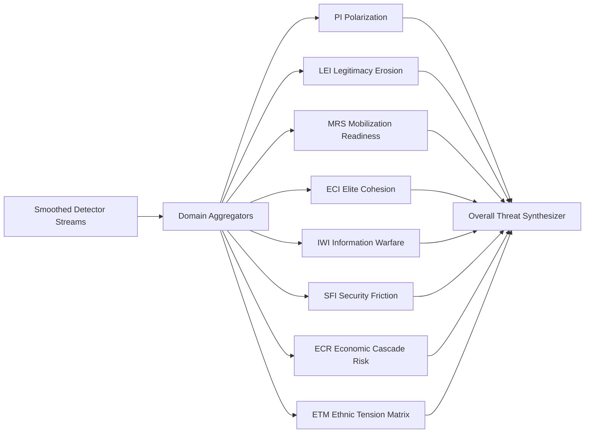

Index construction principles:

1. PI: weights identity-framing intensity, antagonistic sentiment, and cross-group hostility transitions.
2. LEI: weights anti-institution narratives, compliance refusal, and trust-drop velocity.
3. MRS: weights coordination language, action imperatives, and temporal urgency concentration.
4. ECI: measures fragmentation among leadership and elite communication clusters.
5. IWI: combines contradiction density, rumor propagation velocity, and source anomaly patterns.
6. SFI: combines incident pressure, protective response strain, and security narrative volatility.
7. ECR: maps scarcity and instability cues into economic stress propagation potential.
8. ETM: matrix score across protected identity dimensions and regional overlap stress.

### 14.7 Overall Threat Level Synthesis

The final threat score is a weighted composition plus guardrails:

$$
T = \sum_{k=1}^{8} \omega_k I_k + \phi \cdot V - \psi \cdot C
$$

where:

1. $I_k$ are the eight index values.
2. $V$ is volatility pressure from recent variance and acceleration.
3. $C$ is cross-source consensus confidence (higher confidence reduces false alarms).
4. $\omega_k$ are domain weights tuned for policy relevance.

Threat level mapping:

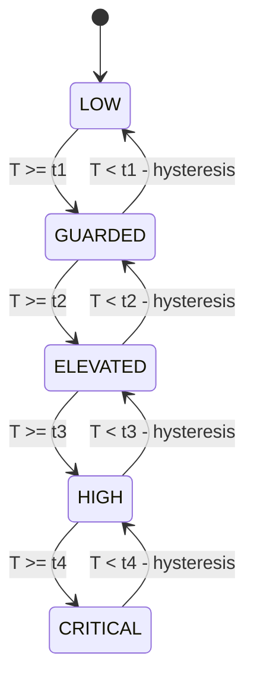

Hysteresis prevents rapid level-flipping when scores hover near thresholds.

### 14.8 Geo Computation for County Heatmaps

County intensity is computed as a blended geo score:

1. Explicit geo mentions in post text.
2. Source metadata geo hints.
3. Topic-to-county priors from historical event distributions.

Each county score is then time-decayed and normalized across the active window.

### 14.9 Calibration, Drift, and Reliability Controls

Pulse includes ongoing calibration loops:

1. Baseline calibration to prevent level inflation during normal high-volume periods.
2. Seasonal adjustment for recurring event cycles.
3. Drift detection on detector distributions.
4. Reliability down-weighting for sources that diverge from corroborated outcomes.
5. Confidence floors before promoting signals to executive critical tiers.

### 14.10 How Pulse Feeds the Simulation Layer

Pulse outputs are transformed into scenario-ready shock vectors:

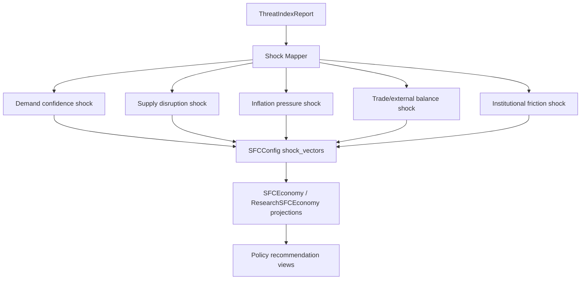

This is the key bridge from social signal intelligence to macroeconomic and sectoral simulation outcomes.

### 14.11 Output Products Produced by Pulse

1. Threat tiles for Executive and Admin dashboards.
2. Geo hotspot payloads for county maps.
3. Trend vectors for archive and historical comparison.
4. Structured rationale payload for explainability and reporting.
5. Shock vectors consumed by simulation engines.

### 14.12 Operational Interpretation Guide

1. Rising PI + LEI with stable MRS: growing social fracture, but low immediate mobilization risk.
2. Rising MRS + SFI together: prioritize near-term coordination and operational readiness.
3. High IWI with low consensus confidence: monitor closely; avoid overreaction to likely manipulation.
4. Rising ECR with moderate social indices: economic interventions may reduce escalation before security hardening is needed.

This Pulse design ensures that high-volume signal streams are converted into interpretable, calibrated, and policy-actionable intelligence rather than raw sentiment noise.

---

## 15. Collaboration, Data Sharing, Privacy, and Encryption Architecture

This section documents how institutions collaborate through the dashboard while preserving privacy, enforcing consent boundaries, and protecting data in transit and at rest.

### 15.1 Collaboration Design Goals

1. Enable cross-institution coordination without forcing raw data exposure.
2. Support role-specific visibility across Executive, Admin, and Local views.
3. Provide verifiable audit trails for every promotion, share, and action.
4. Preserve analytical utility while minimizing privacy leakage risk.
5. Enforce secure transport and cryptographic integrity end to end.

### 15.2 Collaboration Architecture (Dashboard + Backend)

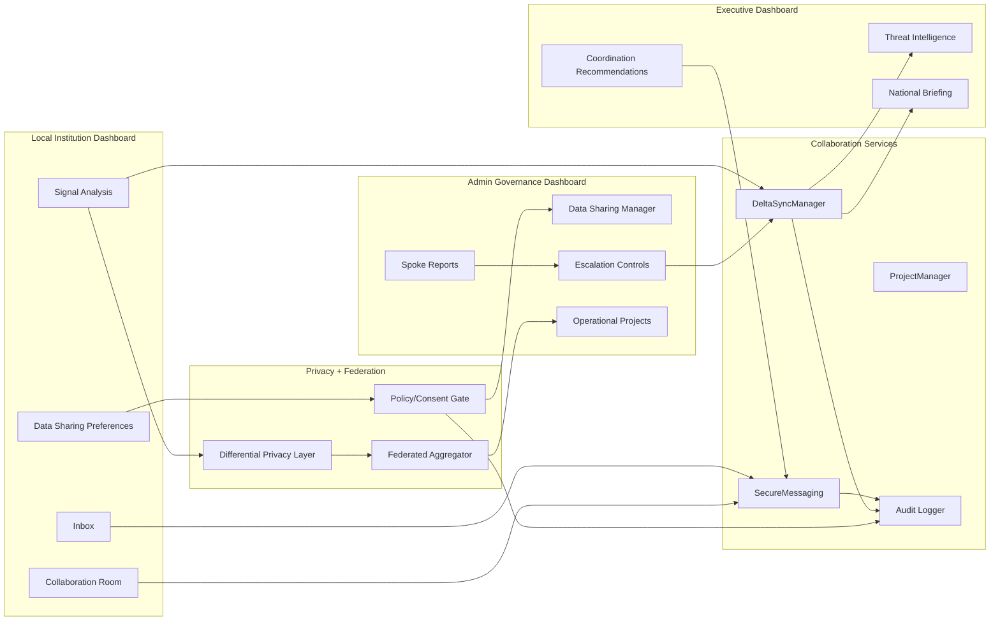

### 15.3 Data Sharing Contract by Mode

The platform supports explicit sharing modes tied to governance policy and institution consent.

1. Mode A (Aggregated Analytics): shares aggregate signals and summary indicators only.
2. Mode B (Federated Learning): shares model updates or gradient-like artifacts, not raw source records.
3. Restricted/Confidential paths: tighten fields and resolution based on policy and role.

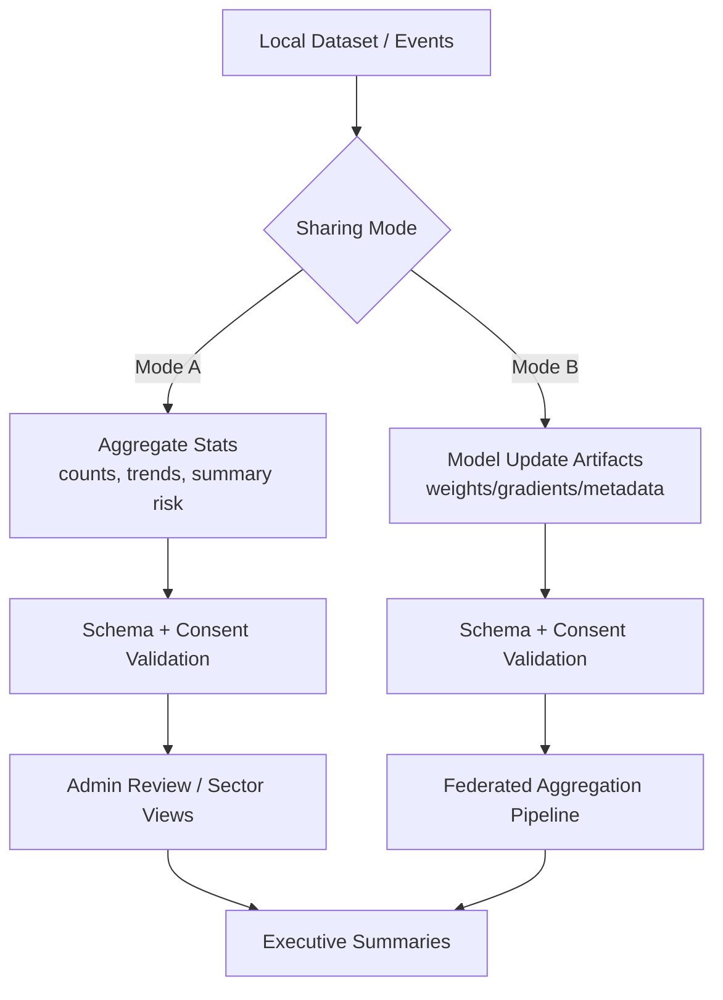

### 15.4 Differential Privacy Pipeline

The privacy pipeline reduces re-identification risk before collaborative learning or cross-node aggregation.

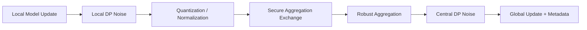

DP control principles:

1. Local perturbation is applied before leaving the institution boundary.
2. Robust aggregation mitigates poisoning and outlier updates.
3. Central perturbation protects aggregate release surfaces.
4. Privacy budget and contribution policy are tracked for governance visibility.

### 15.5 Encryption and Integrity Model

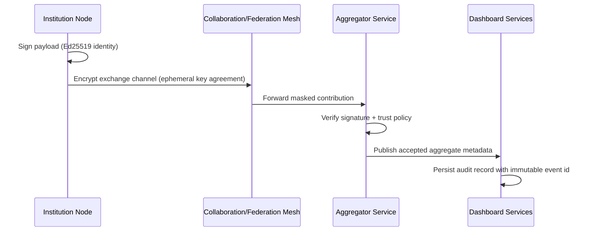

Security guarantees in collaborative paths:

1. Authenticity: signed contributions and actor identity checks.
2. Confidentiality: encrypted transport for inter-node exchange.
3. Integrity: signature verification and tamper-evident logs.
4. Non-repudiation: auditable event trail for governance actions.

### 15.6 Dashboard-Level Collaboration Controls

Control surfaces by role:

1. Local dashboard:
   selects sharing mode, reviews outgoing scope, monitors inbox and directives.
2. Admin dashboard:
   approves/escalates signals, manages sharing agreements, governs schemas, monitors federated rounds.
3. Executive dashboard:
   consumes promoted intelligence, issues coordination directives, tracks operation status.

### 15.7 Collaboration Room and Messaging Flow

```mermaid
flowchart TD
    C1[Institution User Action] --> M1[SecureMessaging]
    M1 --> M2[Role + Scope Authorization]
    M2 --> M3[Delivery Queue]
    M3 --> M4[Recipient Inbox]
    M4 --> M5[Acknowledgement / Follow-up]
    M5 --> AUD[Audit Trail]
```

Messaging design properties:

1. Role-scoped delivery prevents unauthorized cross-sector visibility.
2. Message lifecycle events are auditable.
3. Collaboration threads can be linked to projects and escalation events.

### 15.8 Governance, Audit, and Explainability

Every collaboration-critical operation produces an auditable event:

1. sharing mode changes,
2. schema/consent validation outcomes,
3. promotion/escalation decisions,
4. federated submission acceptance/rejection,
5. directive issuance and acknowledgement.

This ensures policy compliance, post-incident traceability, and explainable collaboration outcomes across institutions.

### 15.9 Public vs Internal Disclosure Guidance

Safe to publish externally:

1. collaboration architecture concepts,
2. sharing-mode semantics,
3. high-level DP and encryption posture,
4. governance and audit principles.

Keep internal only:

1. exact privacy budget values and per-round thresholds,
2. key rotation schedules and key management internals,
3. trust cutoffs, rejection heuristics, and abuse-defense tuning,
4. infrastructure topology and operational endpoint details.

This design allows secure multi-institution collaboration while minimizing sensitive-data exposure and preserving accountability.

---

## 16. Scarcity Core Folder Architecture

This section maps the `scarcity/` package into execution layers, shows how modules connect at runtime, and explains how discovery, simulation, federation, and governance compose into one operating core.

### 16.1 Package Layer Map

```mermaid
flowchart TD
    subgraph IO[Ingestion and Streams]
        S1[stream/]
        S2[synthetic/]
        S3[runtime/]
    end

    subgraph Intelligence[Intelligence and Discovery]
        I1[engine/]
        I2[causal/]
        I3[analytics/]
    end

    subgraph Decision[Simulation and Decisioning]
        D1[simulation/]
        D2[governor/]
        D3[economic_config.py]
    end

    subgraph Distributed[Federated and Meta]
        F1[federation/]
        F2[meta/]
        F3[fmi/]
    end

    subgraph Products[Delivery Surfaces]
        P1[dashboard/]
        P2[tests/]
    end

    S1 --> I1
    S2 --> I1
    S3 --> I1
    I1 --> I2
    I1 --> I3
    I2 --> D1
    I3 --> D1
    D1 --> D2
    D2 --> P1
    I1 --> F1
    F1 --> F2
    F2 --> D1
    F3 --> D1
    D1 --> P2
```

### 16.2 Runtime Backbone and Event Flow

The `runtime/` layer is the orchestration plane that keeps stream processing, model updates, and simulation triggers synchronized.

```mermaid
sequenceDiagram
    participant SRC as stream/ source
    participant RT as runtime/ orchestrator
    participant ENG as engine/ discovery
    participant ANA as analytics/causal
    participant SIM as simulation/
    participant GOV as governor/
    participant UI as dashboard/

    SRC->>RT: normalized event window
    RT->>ENG: process_row / process_batch
    ENG->>ANA: candidate relationships + confidence
    ANA->>SIM: calibrated constraints and shock hints
    SIM->>GOV: projected trajectories and risk envelopes
    GOV->>UI: policy-safe outputs + assurance level
```

Design properties:

1. Runtime sequencing is deterministic for replayability.
2. Discovery updates and simulation runs are loosely coupled by typed handoff payloads.
3. Governor checks are final-stage gates before dashboard publication.

### 16.3 Discovery Core (`engine/` + `causal/`)

The discovery core runs continuous hypothesis competition and promotion under uncertainty.

```mermaid
flowchart LR
    A[Incoming features] --> B[Hypothesis pool update]
    B --> C[Scoring and arbitration]
    C --> D{promotion threshold met?}
    D -->|yes| E[relationship accepted]
    D -->|no| F[relationship retained as tentative]
    E --> G[causal/ validation]
    F --> B
    G --> H[confidence-weighted graph]
    H --> I[simulation-ready linkage map]
```

Operational intent:

1. Keep multiple structural explanations active instead of committing too early.
2. Promote only relationships that remain stable under rolling updates.
3. Preserve confidence metadata so downstream modules can adapt aggressiveness.

### 16.4 Simulation Core (`simulation/`)

The simulation layer is the state-transition engine for policy exploration and stress testing.

```mermaid
flowchart TD
    C0[Config and priors] --> C1[Baseline state initialization]
    C1 --> C2[Apply shocks and policy vectors]
    C2 --> C3[Advance sector transitions]
    C3 --> C4[Compute macro and welfare outputs]
    C4 --> C5[Uncertainty envelopes / scenario set]
    C5 --> C6[Decision payloads]
```

Core guarantees:

1. Same config and seed produce reproducible trajectories.
2. Discovery confidence can scale scenario width and caution flags.
3. Outputs are shaped for both analyst depth and executive summaries.

### 16.5 Governance Core (`governor/`)

The governor is the policy-safety and quality-control layer between model output and operational use.

```mermaid
flowchart LR
    A[Simulation outputs] --> B[Constraint checks]
    B --> C[Stability and feasibility tests]
    C --> D{pass?}
    D -->|yes| E[release with assurance label]
    D -->|no| F[fallback / conservative profile]
    E --> G[dashboard + export]
    F --> G
```

Governor responsibilities:

1. Enforce hard constraints and risk boundaries.
2. Convert technical uncertainty into explicit assurance levels.
3. Trigger safer fallback profiles when data quality or model stability drops.

### 16.6 Federated and Meta Layer (`federation/` + `meta/` + `fmi/`)

The distributed layer improves generalization across institutions while preserving local data boundaries.

```mermaid
flowchart TD
    N1[Institution node A] --> F[federation/ secure exchange]
    N2[Institution node B] --> F
    N3[Institution node C] --> F
    F --> M[meta/ aggregation and prior update]
    M --> X[fmi/ and simulation adapters]
    X --> ENG[engine/]
    X --> SIM[simulation/]
```

Composition rules:

1. Local nodes contribute update artifacts, not raw operational records.
2. Meta updates feed both discovery priors and simulation parameter adaptation.
3. FMI adapters keep cross-model coupling explicit and controlled.

### 16.7 Stream, Synthetic, and Testing Scaffolds

Supporting packages ensure safe iteration and reliable deployment behavior:

1. `stream/` provides live ingestion connectors and event normalization interfaces.
2. `synthetic/` provides controlled stress and scenario generation for calibration and demos.
3. `tests/` anchors regression checks across discovery, simulation, federation, and governance boundaries.

### 16.8 Why This Folder Design Scales

The `scarcity/` layout is intentionally layered so the platform can evolve without tight coupling:

1. Ingestion and runtime concerns are separated from model logic.
2. Discovery and simulation can iterate independently but exchange typed contracts.
3. Federation and meta-learning remain optional accelerators, not hard runtime dependencies.
4. Governance remains a mandatory release gate for operational safety.

This is the core Scarcity design: continuous discovery, guarded simulation, and secure distributed learning assembled as a modular architecture rather than a monolithic pipeline.
