# Public Architecture Overview
## K-Scarcity / K-SHIELD / Pulse Intelligence

This document is intentionally designed for public website publication.
It explains what the platform does, how information flows, and what outcomes it supports, while excluding sensitive security internals and operationally exploitable details.

---

## 1. What The Platform Does

The platform turns multi-source social, economic, and institutional signals into decision-support intelligence for public-sector and institutional teams.

Core outcomes:

1. Early warning of rising pressure and instability patterns.
2. Clear, plain-language threat and risk summaries for leadership.
3. Scenario-based simulation to test policy options before action.
4. Coordinated workflows across executive, sector admin, and local teams.

---

## 2. Public High-Level System Map

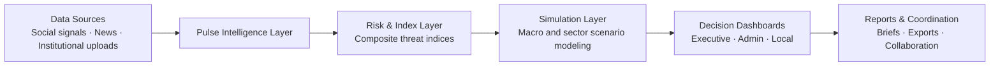

---

## 3. Pulse Intelligence (Public View)

Pulse continuously processes incoming signals and produces interpretable risk indicators.

Public design summary:

1. Ingestion from multiple channels.
2. Normalization and quality checks.
3. Signal classification and thematic scoring.
4. Composite index generation.
5. Human-readable outputs for dashboards and reports.

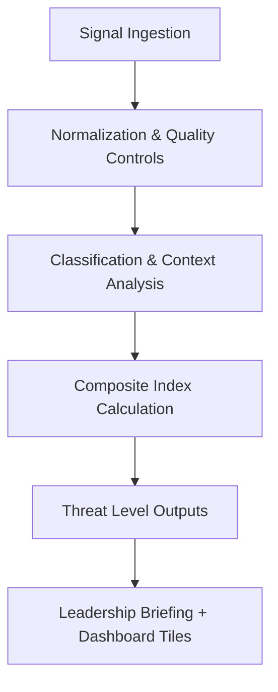

Interpretation principle:

1. A single signal does not determine a final risk level.
2. Aggregated multi-signal trends drive confidence.
3. Persistent movement matters more than isolated spikes.

---

## 4. Risk Indices (Public Summary)

The platform computes multiple domain indices and then synthesizes an overall threat level.

Representative domains:

1. Polarization and social friction.
2. Institutional legitimacy pressure.
3. Mobilization readiness.
4. Information integrity pressure.
5. Economic cascade risk.
6. Security friction.

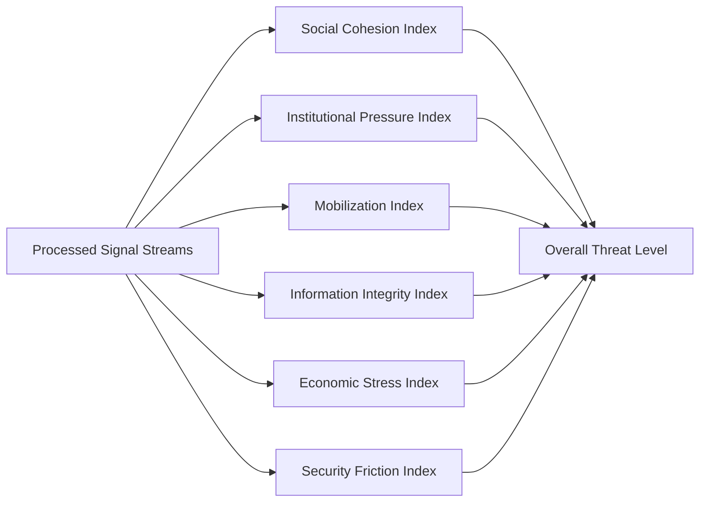

Public-level scoring behavior:

1. Indices are normalized for consistency.
2. Stability controls reduce false alerts from temporary bursts.
3. Threshold bands provide clear risk stages for action planning.

---

## 5. Simulation And Decision Support

Risk outputs feed simulation models to test possible policy responses under multiple scenarios.

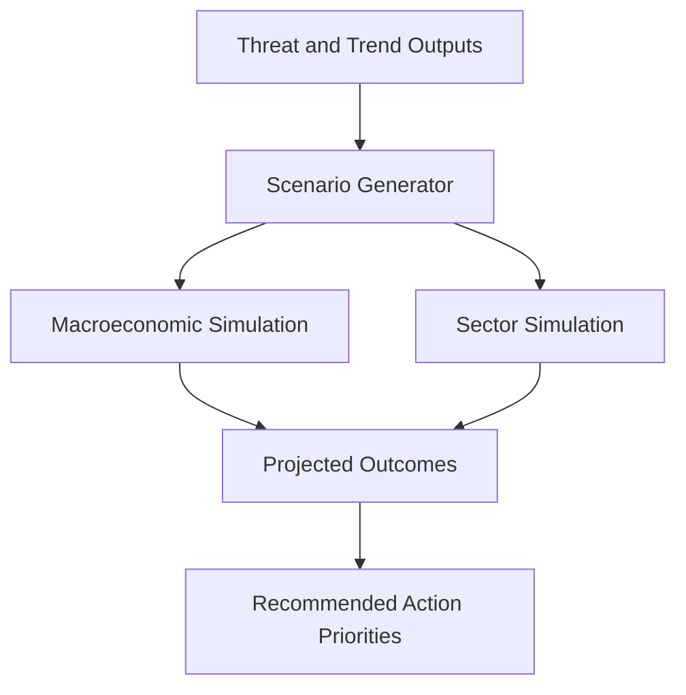

Decision-support characteristics:

1. Compare intervention pathways.
2. Estimate expected direction and relative impact.
3. Support staged response planning.
4. Provide transparent rationale for leadership discussions.

---

## 6. Dashboard Roles (Public)

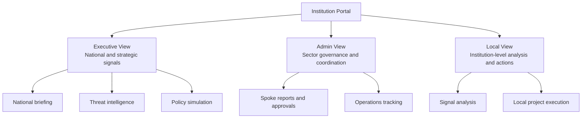

Each role receives tailored information while maintaining coordinated workflows.

---

## 7. Reporting And Exports (Public)

The system supports plain-language reporting for broad audiences and structured exports for technical review.

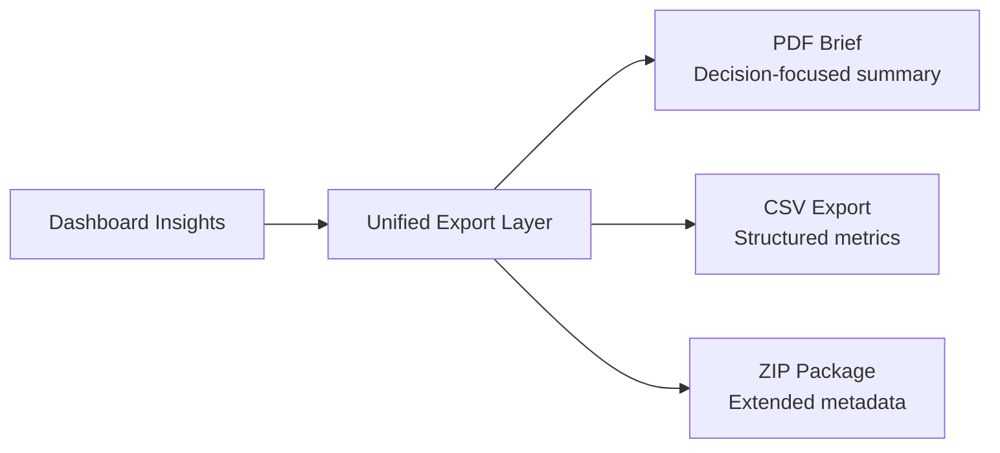

Public reporting principles:

1. Explain outcomes in plain language first.
2. Keep supporting evidence accessible.
3. Preserve a traceable path from signal to recommendation.

---

## 8. Security And Governance (Public Statement)

The platform applies a layered trust and governance model with role-based access, auditability, and privacy-preserving workflows.

Public commitments:

1. Access controls and role separation.
2. Audit trails for critical actions.
3. Responsible use and human oversight.
4. Privacy-aware collaboration patterns.

Note:
This public document intentionally omits internal thresholds, detector internals, anti-abuse controls, and infrastructure-level security implementation details.

---

## 9. Known Limits (Public)

All intelligence systems have constraints. This platform is designed for decision support, not automatic enforcement.

1. Signal quality can vary by source coverage.
2. Rapid event shifts can temporarily increase uncertainty.
3. Human interpretation remains essential for high-impact decisions.

---

## 10. Intended Public Website Placement

Recommended page usage:

1. Product overview page: Sections 1-2.
2. How it works page: Sections 3-5.
3. Roles and operations page: Section 6.
4. Trust and governance page: Sections 8-9.
5. Reporting page: Section 7.

This structure gives website visitors clear understanding without exposing sensitive internals.

---

## 11. Simulation Engine Deep Dive (Public)

This section explains how the Simulation Engine transforms risk intelligence into forward-looking scenario outcomes for decision support, including advanced modes, uncertainty systems, and multidimensional analysis views.

### 11.1 Simulation Engine Purpose

The Simulation Engine is designed to answer five public-facing policy questions:

1. What is likely to happen if no action is taken?
2. Which intervention pathway performs better under uncertainty?
3. How quickly do outcomes diverge across policy options?
4. Which sectors are most exposed over the next planning horizon?
5. What trade-offs appear across growth, inflation, employment, and social pressure?

### 11.2 End-to-End Simulation Flow

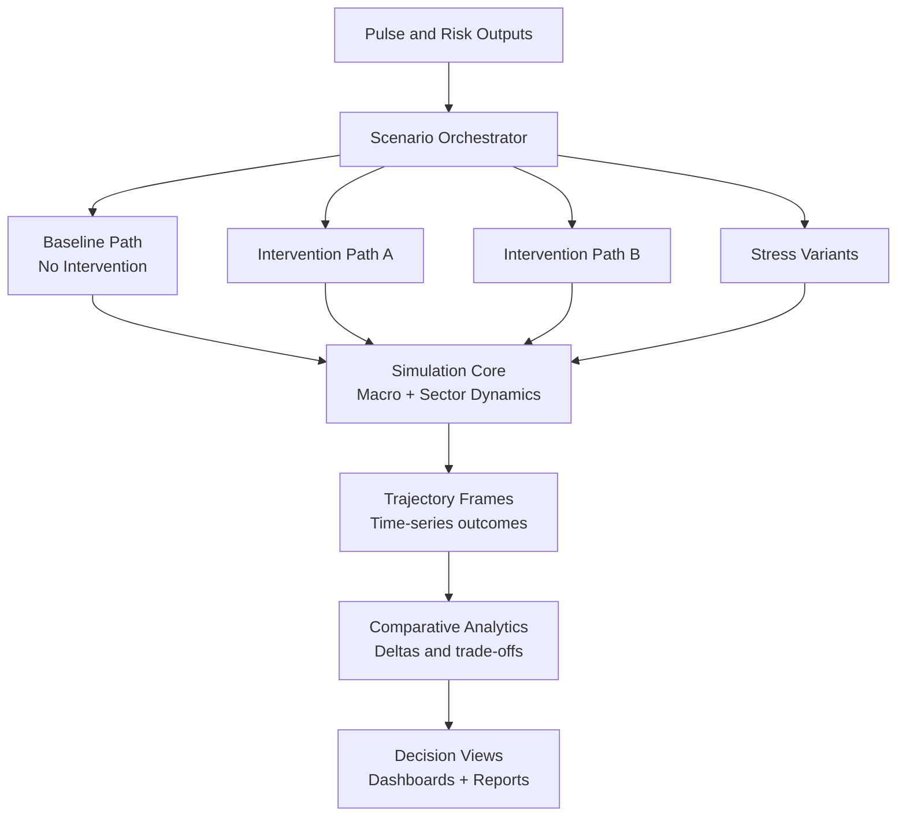

### 11.3 Layered Architecture

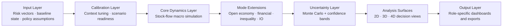

Layer responsibilities:

1. Input Layer standardizes assumptions, shock context, and time horizon.
2. Calibration Layer aligns scenario setup with latest contextual baselines.
3. Core Dynamics Layer computes macro trajectories over time.
4. Mode Extensions layer adds domain-specific realism.
5. Uncertainty Layer estimates plausible ranges around central paths.
6. Analysis Surfaces layer converts trajectories into comparative decision tools.
7. Output Layer publishes interpretable insights for each user role.

### 11.4 Engine Modes

The Simulation Engine supports multiple modes, each adding analytical depth:

1. Core Mode: baseline macro pathway simulation for policy comparison.
2. Open Economy Mode: trade, reserve, and currency-pressure dynamics.
3. Financial Mode: credit-cycle and banking-stability pressure analysis.
4. Inequality Mode: distribution-sensitive outcomes across population segments.
5. IO Mode: inter-sector propagation across connected production systems.
6. Research Workbench Mode: full advanced exploration combining all extensions.

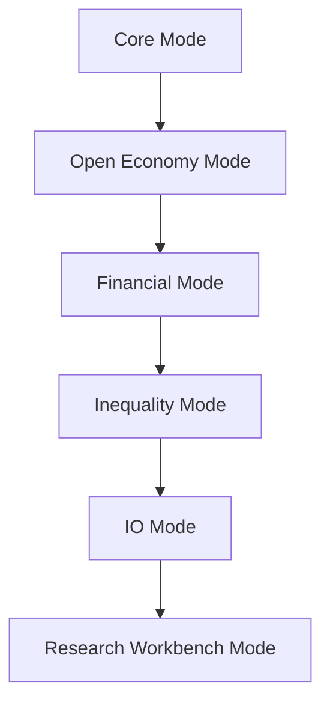

### 11.5 Custom Shock System

Custom shocks allow users to model realistic disruptions with controlled timing and magnitude.

Capabilities:

1. Multi-channel targets such as demand, supply, trade, currency, and confidence.
2. Temporal controls for start period, duration, and sequence ordering.
3. Shape options including step, pulse, ramp, decay, and cyclical behavior.
4. Multi-shock stacking so complex events can be composed in one scenario.

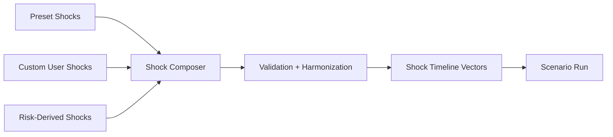

### 11.6 Custom Policy System

The policy layer supports both template-based and custom intervention design.

Policy design dimensions:

1. Instrument type: monetary, fiscal, sectoral, emergency.
2. Intensity: low, medium, high or user-defined gradients.
3. Timing: immediate, staged, delayed, or sequenced response.
4. Composition: combine several instruments into a coordinated policy package.
5. Comparison: evaluate multiple policy mixes against baseline.

### 11.7 Scenario Orchestration

Scenarios are orchestrated as a portfolio, not isolated runs.

1. Baseline is generated first as a reference pathway.
2. Intervention scenarios are executed in parallel for comparability.
3. Stress variants are applied to test policy robustness.
4. Outputs are normalized into one comparison layer for decision review.

### 11.8 Monte Carlo and Confidence Logic

The Simulation Engine uses repeated stochastic variants to quantify uncertainty.

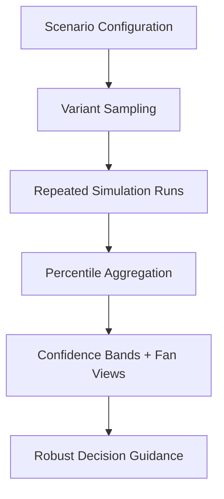

Public uncertainty principles:

1. Show ranges, not only one deterministic line.
2. Use median pathways for central interpretation.
3. Evaluate tail ranges for contingency planning.
4. Prefer policies that remain stable across wide bands.

### 11.9 Advanced Analysis Surfaces

The engine provides many analysis surfaces for different decision questions:

1. Compare Runs: side-by-side scenario trajectory overlays.
2. Sensitivity Matrix: outcome response to parameter and policy variation.
3. Phase Explorer: state-space trajectory movement over time.
4. Impulse Response: shock propagation and recovery dynamics.
5. Stress Matrix: scenario-by-outcome pressure map.
6. Parameter Surface: multidimensional response landscape.
7. Monte Carlo Fan Views: uncertainty envelopes over horizon.
8. 3D and 4D State Views: multidimensional policy-state interpretation.

### 11.10 4D Visualization Perspective

The 4D view allows stakeholders to track multiple macro dimensions together rather than one metric at a time.

Typical 4D interpretation pattern:

1. Axis X: growth or output movement.
2. Axis Y: inflation pressure trajectory.
3. Axis Z: employment or stability path.
4. Fourth dimension: welfare, risk score, or color-encoded pressure state.

This helps teams spot stability corridors, divergence patterns, and policy turning points faster.

### 11.11 Simulation Output Contract

The Simulation Engine returns structured outputs for dashboards and reports:

1. Time-series trajectories for key indicators.
2. Scenario deltas versus baseline pathways.
3. Sector impact summaries and pressure markers.
4. Confidence-oriented interpretation notes.
5. Planning priorities suitable for executive and operational workflows.

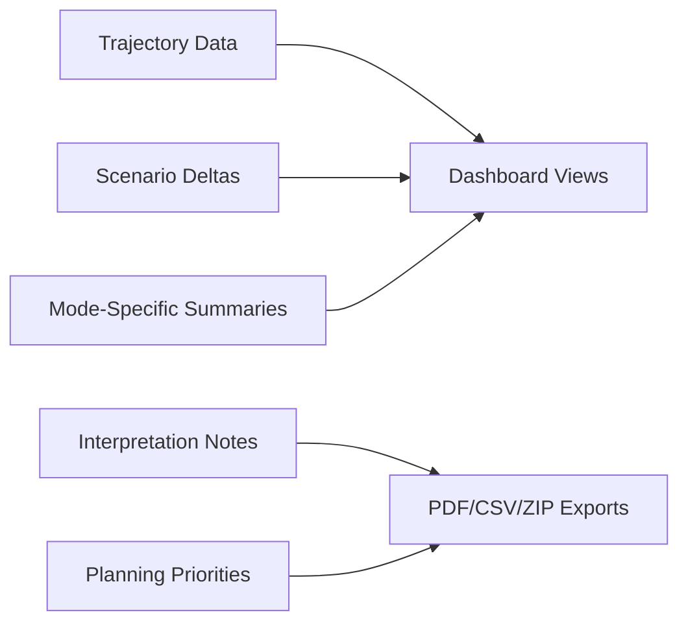

### 11.12 Role-Based Consumption

Simulation outputs feed different roles with tailored focus:

1. Executive: strategic pathway selection and national-level trade-offs.
2. Admin: sector coordination, escalation planning, and allocation decisions.
3. Local Institution: operational priorities and monitoring checkpoints.

### 11.13 Public vs Private Boundary

Safe to publish:

1. High-level architecture, modes, and analysis capabilities.
2. Scenario-comparison concepts and uncertainty interpretation.
3. Role-based usage patterns and output semantics.

Keep private in internal documentation:

1. Internal coefficients, calibration constants, and threshold mechanics.
2. Security-sensitive validation and anti-manipulation internals.
3. Infrastructure-level control logic and deployment-specific tuning.

This keeps the Simulation Engine understandable to external audiences while preserving operational safety.

---
