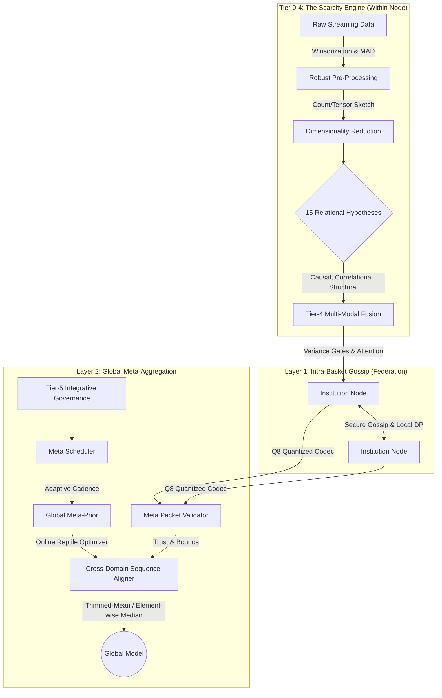

# K-Scarcity

**Strategic National Economic & Threat Intelligence Layer**

An AI-powered early warning system that detects emerging threats to national stability by fusing economic indicators, social signals, and critical infrastructure data. 

K-Scarcity's core is the **Scarcity Engine**, an industrial-grade, secure, and privacy-preserving machine learning infrastructure. It is designed to handle massive, dirty data streams, run complex multi-hypothesis causal inference in real-time online, and synthesize knowledge across multiple isolated institutional silos via Secure Hierarchical Federated Learning.

## Architecture Overview



---

## 1. The Scarcity Engine: Online Learning & Transformation

At the heart of K-Scarcity is an online discovery engine that processes streaming data without batch-training. It relies on a suite of robust statistical, dimensionality reduction, and causal analysis algorithms.

### 1.1. Robustness & Pre-Processing (Cleaning the Stream)
Before data is analyzed, it must survive adversarial or noisy conditions using robust statistics:
*   **Online Winsorization:** A sliding-window percentile tracker that actively clips extreme data spikes to the 5th and 95th percentiles.
*   **Online MAD (Median Absolute Deviation):** Constantly calculates the median variance of the stream, completely ignoring severe outliers (vastly superior to tracking standard deviation on noisy streams).
*   **Huber Loss Gradient Clipping:** Used internally by the engine to dynamically shift between quadratic and linear gradient adjustments if errors blow up out of nowhere.

### 1.2. High-Speed Encoding & Sketching (Dimensionality Reduction)
As variables and polynomial combinations explode exponentially, the Engine uses "Sketching" to crush data into manageable geometries:
*   **CountSketch & Polynomial Sketch:** Uses FFT (Fast Fourier Transform) Convolutions to mathematically approximate the cross-interactions of variables without ever instantiating the full polynomial matrix.
*   **Tensor Sketch (Kronecker Products):** Rapidly compresses pair-wise matrices into tiny 1D representations.
*   **Sparse Top-K Attention & Linear Attention:** Uses Transformer-style attention matrices (`Q·K^T·V` in FP16), but uses a Top-K mask to immediately drop attention weights on irrelevant variables.
*   **Lag Positional Encodings:** Borrowed from LLMs, it maps integer time-lags into dense embedded arrays so the engine knows *when* an event happened relative to others.

### 1.3. The 15 Relational Hypotheses (Continuous Online Testing)
The engine runs 15 competing hypotheses continuously over the data stream. Rather than testing these globally at the end, it uses streaming algorithms to track them as active mathematical constraints:

1.  **Causal (Granger)**: Uses **Augmented Ridge Regression** to test if past values of $X$ predict $Y$ better than $Y$ alone, determining direction via predictive gain.
2.  **Correlational (Pearson)**: Uses **Welford's Online Algorithm** to sustainably compute variance and covariance iteratively without MemoryOverFlow.
3.  **Temporal (VAR(p) Autoregressive)**: Uses **Recursive Least Squares (RLS)** and Kalman Gain to update Auto-Regressive coefficients online.
4.  **Functional (Polynomial)**: Uses RLS to fit online continuous polynomial curves ($Y = f(X)$).
5.  **Equilibrium (Mean-Reverting)**: Employs a **1D Kalman Filter** to estimate invisible stable equilibrium levels, regressing the deviations to find the reversion rate.
6.  **Compositional (Sum Constraints)**: Tracks additive constraints ($Total = \sum Parts$) measuring "leakages" via relative Mean Absolute Error.
7.  **Competitive (Trade-off)**: Tracks the **Coefficient of Variation** ($CV = \frac{\sigma}{\mu}$) of the sum $X+Y$ over time to mathematically detect zero-sum cannibalization.
8.  **Synergistic (Interaction)**: Uses Online Multiple Regression to track the coefficient significance of the $X_1 \times X_2$ interaction term.
9.  **Probabilistic (Distribution Shift)**: Computes **Cohen's $d$** effect size dynamically to detect regime splits where $X$ shifts the distribution of $Y$.
10. **Structural (Hierarchical)**: Tracks the **Intraclass Correlation Coefficient (ICC)** by calculating online between-group vs. within-group variance.
11. **Mediating (Baron-Kenny)**: Tracks indirect paths measuring changes in $X \rightarrow Y$ effects when conditionally controlling for intermediate variable $M$.
12. **Moderating (Conditional Effects)**: Uses online regression to check if a $Z$ term significantly changes the steepness of the $X \rightarrow Y$ slope.
13. **Graph (Network Structure)**: Measures adjacency network density and average out-degree clustering mathematically over sequences.
14. **Similarity (Clustering)**: Uses **Online Mini-Batch K-Means** with moving cluster centers and silhouette-like variance ratio tracking.
15. **Logical (Boolean Rules)**: Continuously tests binary variable states passing through boolean gates (AND, OR, XOR, NAND) checking for sequence accuracy >80%.

### 1.4. Adaptive Coarse-to-Fine Grouping
When modeling hundreds of variables, the Engine dynamically clusters them using **VariableGroups**. 
It tracks the internal Online MAD (Median Absolute Deviation) of prediction errors (residuals) for each group. If a cluster of variables can no longer be accurately predicted as a single unit (i.e. residual pressure crosses a threshold), the engine mathematically "shatters" the group back into atomic variables or smaller subgroups for higher-resolution modeling.

### 1.4. Vectorized Core
Instead of running 10,000 Python objects, the engine uses **Massively Parallel Batch Recursive Least Squares (RLS)** via `numpy.einsum` to mathematically solve thousands of equations simultaneously in $O(1)$ Python overhead, bypassing normal looping bottlenecks.

### 1.5. Concept Drift & Stability Validators
The **Evaluator** mathematically tortures the rules to see if they break:
*   **Bootstrap Confidence Intervals:** Bootstraps sub-samples to build $R^2$ interval ranges.
*   **Page-Hinkley Concept Drift:** A sequential analysis algorithm that explicitly detects "Regime Shifts" (when the fundamental rules of the system suddenly change).
*   **Spearman Rank Concordance:** Checks if the rank-order of importance changes across different time windows.
*   **Sign-Agreement Validation:** Discards rules if the mathematical sign flips between positive/negative randomly.

### 1.6. Causal Semantics & Graph Mathematics
*   **Counterfactual Jacobian Perturbation:** Automatically injects random Gaussian noise into a modeled equation and uses the local Jacobian matrix to simulate "what-if" counterfactuals.
*   **Multi-hop Causal Breadth-First-Search:** Follows causal chains down the line (e.g., $A \rightarrow B, B \rightarrow C \Rightarrow A \rightarrow C$).
*   **Random Walk with Restart (RWR):** Computes proximity vectors to establish how "influential" a node is based on the stationary distribution of randomized graph walking.
*   **Eigen-vector Diffusion Sketching:** Uses power-series approximations to propagate causal signals across the whole network.
*   **Signed Message Passing:** Evaluates positive and negative graph embeddings using $m^+ = A^+ x$ and $m^- = A^- x$ routing.
*   **Parsimony Hierarchy Arbitration:** If two rules contradict (e.g., "X correlates to Y" and "X causes Y"), it runs a conflict logic to delete the weaker assumption.

### 1.7. Tier-4 Integrative Orchestration
Before sending discoveries up to the Federation layer, the engine combines its structural, relational, and causal latents into unified multi-modal representations:
*   **Multi-Modal Fusion**: Uses energy-normalized **Variance Gates** and **Linear Attention** (`Q·K^T·V`) to mathematically blend different latents without losing signal dominance.
*   **Cross-Tier Reconciliation**: Applies iterative **Energy-Weighting** to force mathematical consensus and minimize disagreement between conflicting latents generated by different engine tiers.

---

## 2. The Federation Layer: Secure Hierarchical Machine Learning

The Federation component allows hundreds of different institutions (banks, insurers, governments) to collectively train the Scarcity Causal Engine without *ever* sharing their raw data. 

### 2.1. Two-Layer Hierarchical Topology & Meta-Learning
The engine operates in two distinct rings with a Tier-5 Meta-Integrative Layer:
*   **Layer 1 (Intra-Basket Gossip):** Institutions within the same sector (e.g., all banks in a "Financial" basket) use decentralized Gossip Protocols to peer-to-peer share parameter updates. 
*   **Layer 2 (Global Meta-Aggregation):** The central server only aggregates the consensus from the *Baskets*, extracting overarching macro-economic parameters.
*   **Cross-Domain Meta Learning:** When merging meta-updates from completely different sectors (e.g., Telecoms vs Finance), differences in domain size and data variance can cause global model collapse. The server uses a **Cross-Domain Sequence Aligner** that dynamically matrices the parameter keys and uses one of two robust mathematics:
    *   **Trimmed-Mean Aggregation**: Sorts the multi-dimensional updates and drops the highest and lowest mathematical outliers (e.g., top 10% and bottom 10%) before averaging the rest.
    *   **Element-wise Median**: Computes the strict median across domains, rendering the global update completely immune to up to 50% corrupted adversarial domains.
*   **Online Reptile Optimizer:** Instead of just averaging the updates, the server maintains a Global Prior and calculates the gradient step towards the aggregated update, scaling it by a dynamic learning rate ($\beta$).
*   **Domain Meta-Learner:** Computes a dynamic, per-domain Meta Learning Rate using an **Exponential Moving Average (EMA)** of their historical confidence and performance stability.
*   **Meta Scheduler (Load-Aware Cadence):** Meta-learning isn't triggered on a hardcoded clock; it is dynamically triggered by the `processing_metrics` throughput of the engine. The Scheduler maintains an adaptive window counter that mathematically dilates or constricts based on real-time telemetry:
    *   **Under Heavy Load (Latency > 80ms or high VRAM):** Multiplies the required interval by `0.7` (a decay factor), actually *speeding up* the cadence (down to 3 windows) to rapidly force meta-parameter updates to shed load and increase pruning.
    *   **Low Bandwidth:** Additively increases the interval (+2), mathematically slowing down the frequency of massive global broadcasts (up to 20 windows) to prevent network choking.
    *   **Cruising (Latency < 56ms):** Multiplies the interval by `0.8` to dynamically leverage free compute for deeper meta-learning.
    *   **Anti-Synchronization Jitter:** Injects a randomized $\pm 10\%$ mathematical jitter to the final interval calculation to prevent hundreds of federated nodes from simultaneously syncing and causing DDoS effects.
*   **Meta Packet Validator:** A mathematical gatekeeper ensuring strict confidence floors, gradient size limits, and $L_2$ boundary bounds on incoming meta-gradients.

### 2.2. Cryptographic Secure Aggregation (Pairwise Masking)
To guarantee that the central server cannot reverse-engineer a specific node's data from their model update, Scarcity uses Bonawitz-style Pairwise Masking:
*   **Identity & Ephemeral Keys:** Every institution has a long-term Ed25519 signature. At the start of a round, every node generates a temporary X25519 Diffie-Hellman key and exchanges it with every other node.
*   **HKDF-SHA256 Derivation:** Nodes use the shared secret to seed a random number generator, agreeing on a synchronized "noise mask". One node adds the noise to their data, the other node subtracts it.
*   **Summation Cancellation:** When the central server sums all the updates together, all the positive and negative noise perfectly cancels out to zero. The server gets the perfectly accurate aggregate sum, but the individual updates remain pure mathematical gibberish to everyone else.

### 2.3. Differential Privacy (DP)
To prevent "Membership Inference Attacks":
*   **Local DP:** Nodes inject Laplace noise into their weights before gossiping.
*   **Central DP:** The aggregator adds calibrated Gaussian noise into the final global model. The standard deviation ($\sigma$) of the noise is mathematically constrained by an $\epsilon$ (privacy budget) and $\delta$ (failure probability) parameter: $\sigma = \text{sensitivity} \times \frac{\sqrt{2 \ln(1.25/\delta)}}{\epsilon}$

### 2.4. Byzantine-Robust Aggregation (Defeating Poisoning)
If a malicious node (or a hijacked basket) tries to upload deliberately corrupted weights to destroy the model (a "Byzantine" attack), the aggregator ignores them using cutting-edge defenses:
*   **Coordinate-wise Trimmed Mean:** Discards the top 10% and bottom 10% of all submitted values before averaging the rest.
*   **Krum & Multi-Krum:** Calculates the pairwise Euclidean distance between all submitted models, and entirely rejects any models that are mathematically too far away from the "center of mass".
*   **Bulyan:** A hyper-defensive combination that runs Krum to find the safest models, and then runs Trimmed Mean on the survivors. It is virtually immune to poisoning.

### 2.5. Exponential Trust Scoring & L2 Materiality
The central server maintains an invisible `TrustScorer` for every node. It continually tracks **Agreement (60%), Compliance (30%), Impact (10%)**.
If a node's trust score drops below `0.2`, the `PacketValidator` kicks in and silently sandboxes them—accepting their packets to keep up appearances, but throwing the data straight into the trash before aggregation.

Furthermore, out on the edge, clients use a **Relative L2 Materiality Detector** ($\frac{||x_{new} - x_{old}||_2}{||x_{old}||_2}$) to calculate whether their models have shifted enough to even warrant broadcasting. This prevents network spam. 

### 2.6. Exponential Time-Decay Message Merging & EMA Scheduling
*   **Time-Decay Merging:** Gossip protocol updates don't just get averaged; an **Exponential Decay Half-Life** ($w = e^{-\text{age} \cdot \ln(2) / \text{half\_life}}$) heavily penalizes "stale" updates.
*   **EMA Scheduling:** Nodes dynamically throttle their own network output based on system stress. An **Exponential Moving Average** of system latency triggers a **1.25x Backoff Penalty** on network activity if latency spikes, or a **0.7x Boost Factor** if bandwidth frees up.

### 2.7. Non-IID Update Heterogeneity Diagnostics
Because data distributions differ wildly between agencies (Non-IID), the server calculates the **Coefficient of Variation** (Standard Deviation / Mean) across the norms of all received tensors, alongside the pairwise **Cosine Distances** between everything. If the variance spikes above 75%, it alerts the hard-problem assessor that the federated updates are dangerously heterogenous and might break convergence.

### 2.8. Tensor Quantization Codec
Before math leaves the machine, arrays are mathematically crushed. The **Federated Meta-Intelligence (FMI) Codec** dynamically quantizes floating point tensors into smaller representations.
*   **Q8 Cent-Rounding Precision:** Specifically scales the floats into an 8-bit integer space by rounding to the nearest mathematical cent ($10^{-2}$), perfectly compressing economic and numerical payloads without losing semantic fidelity across the network.

---

##  Quick Start

### Installation

```bash
# Clone the repository
git clone https://github.com/Omega-Labs/scarcity.git
cd scarcity

# Create virtual environment
python -m venv .venv

# Windows
.\.venv\Scripts\activate
# Linux/Mac
source .venv/bin/activate

# Install the scarcity library (editable mode)
pip install -e pypi/

# For backend development, also install backend deps
pip install -r backend/requirements.txt

# For the Streamlit dashboard
pip install streamlit plotly pandas numpy cryptography
```

### Run the Dashboard

```bash
# From the project root
streamlit run kshiked/ui/app.py
```

### Run Tests

```bash
pytest tests/ -v
```

---

##  License

This project is licensed under the Apache License 2.0 - see the [LICENSE](LICENSE) file for details.

##  Team

**Omega Labs** — Lead Developer
🌐 [omegamakena.co.ke](https://omegamakena.co.ke/)
