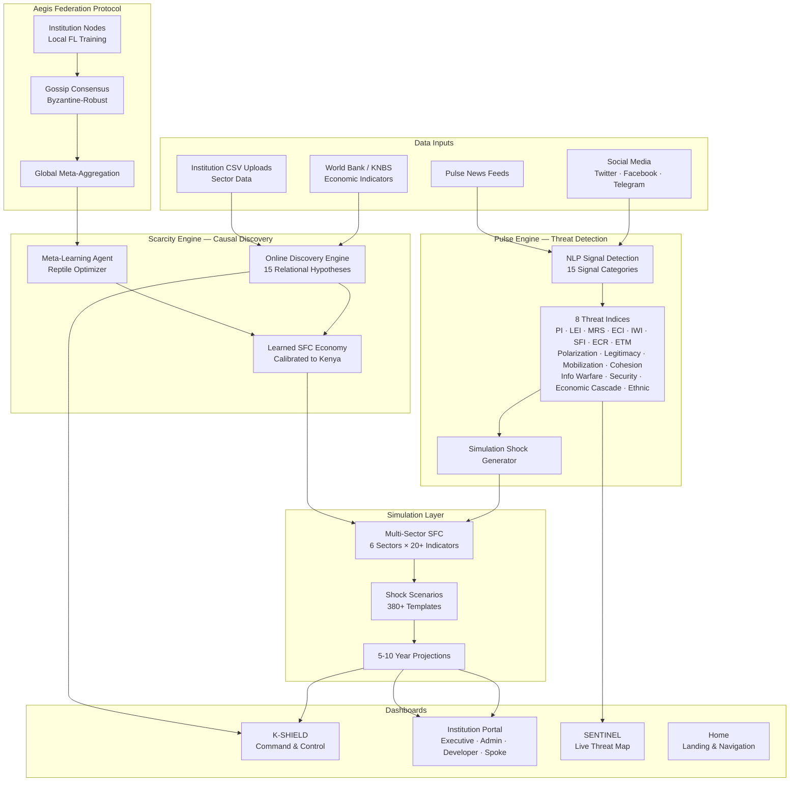

# K-Scarcity — Strategic National Economic & Threat Intelligence Platform

**An AI-powered early-warning and decision-support system for national economic stability.**

K-Scarcity fuses economic indicators, social media signals, and critical infrastructure data into a unified command layer. It learns causal relationships from real data, runs forward simulations of economic stress, surfaces threat intelligence from social signals, and delivers actionable briefings to institutional decision-makers — all through a federated, privacy-preserving architecture.

---

## System at a Glance


```mermaid
flowchart TD
    subgraph Inputs["Data Inputs"]
        A1[Social Media\nTwitter · Facebook · Telegram]
        A2[World Bank / KNBS\nEconomic Indicators]
        A3[Institution CSV Uploads\nSector Data]
        A4[Pulse News Feeds]
    end

    subgraph Pulse["Pulse Engine — Threat Detection"]
        B1[NLP Signal Detection\n15 Signal Categories]
        B2[8 Threat Indices\nPI · LEI · MRS · ECI · IWI · SFI · ECR · ETM\nPolarization · Legitimacy · Mobilization · Cohesion\nInfo Warfare · Security · Economic Cascade · Ethnic]
        B3[Simulation Shock Generator]
    end

    subgraph Scarcity["Scarcity Engine — Causal Discovery"]
        C1[Online Discovery Engine\n15 Relational Hypotheses]
        C2[Learned SFC Economy\nCalibrated to Kenya]
        C3[Meta-Learning Agent\nReptile Optimizer]
    end

    subgraph Simulation["Simulation Layer"]
        D1[Multi-Sector SFC\n6 Sectors × 20+ Indicators]
        D2[Shock Scenarios\n380+ Templates]
        D3[5-10 Year Projections]
    end

    subgraph Federation["Aegis Federation Protocol"]
        E1[Institution Nodes\nLocal FL Training]
        E2[Gossip Consensus\nByzantine-Robust]
        E3[Global Meta-Aggregation]
    end

    subgraph Dashboards["Dashboards"]
        F1[K-SHIELD\nCommand & Control]
        F2[Institution Portal\nExecutive · Admin · Developer · Spoke]
        F3[SENTINEL\nLive Threat Map]
        F4[Home\nLanding & Navigation]
    end

    A1 --> B1
    A4 --> B1
    B1 --> B2
    B2 --> B3
    B3 --> D1

    A2 --> C1
    A3 --> C1
    C1 --> C2
    C2 --> D1
    C3 --> C2

    D1 --> D2
    D2 --> D3
    D3 --> F1
    D3 --> F2

    E1 --> E2
    E2 --> E3
    E3 --> C3

    B2 --> F3
    D3 --> F2
    C1 --> F1
```

---

## Dashboards

### K-SHIELD — Command & Control
The analytical core. Four sub-modules:

| Module | What It Does |
|--------|-------------|
| **Causal Relationships** | Force-directed graph of discovered economic causal chains, Granger tests, confidence rankings |
| **Policy Terrain** | 3D stability landscape (inflation × unemployment → instability), current position marker |
| **Simulations** | Full SFC runs across 6 sectors, shock designer, scenario library, 4D state cube |
| **Policy Impact** | Public sentiment on active policies, scarcity vector tracking, social cohesion metrics |

```
streamlit run kshiked/ui/kshield/page.py --server.port 8505
```

### Institution Portal — Executive · Admin · Developer · Spoke
Multi-role institutional dashboard with:

- **Executive Dashboard** — National briefing, threat intelligence, sector reports, command & control, policy simulator, collaboration room
- **Admin Governance Console** — Pending institution approvals, audit logs, topology injection, security lattice
- **Developer Dashboard** — Technical metrics, model quality, causal adapter inspection
- **Local (Spoke) Dashboard** — County-level analytics, localized cost-of-delay projections
- **Collaboration Room** — Cross-institution secure messaging and shared analysis
- **FL Dashboard** — Federated learning round management, model registry

```
streamlit run kshiked/ui/institution/page.py --server.port 8506
```

### SENTINEL — Live Threat Command Center
Real-time operational dashboard:
- Live threat map of Kenya (county-level)
- Multi-node federation gossip topology
- Policy chat (natural-language recommendations)
- Causal simulation interactive testing
- Signal analysis deep-dive
- Escalation management

```
streamlit run kshiked/ui/sentinel_dashboard.py --server.port 8507
```

---

## Core Modules

### 1. Pulse Engine (`kshiked/pulse/`)
Real-time social media threat detection pipeline.

**Signal Categories (15 total):**
- Distress signals (food/water scarcity, healthcare access collapse)
- Anger signals (directed rage, dehumanization language)
- Institutional signals (legitimacy rejection, authority dismissal)
- Identity signals (ethno-regional framing)
- Information warfare (rumor velocity, conspiracy spreading)

**8 Computed Threat Indices:**

| Index | Description |
|-------|-------------|
| **PI** — Polarization Index | Group division, extremism language, bond fracture |
| **LEI** — Legitimacy Erosion | Authority rejection trajectory |
| **MRS** — Mobilization Readiness | Protest and violence risk |
| **ECI** — Elite Cohesion | Leadership fracture signals |
| **IWI** — Information Warfare | Misinformation intensity |
| **SFI** — Security Friction | Stability erosion signals |
| **ECR** — Economic Cascade Risk | Shock propagation probability |
| **ETM** — Ethnic Tension Matrix | Kenya-specific 12-group tension tracking |

**Shock Mapping:** Each index above threshold triggers economic shocks (GDP, inflation, trade, confidence, currency) that feed directly into the simulation engine.

---

### 2. Scarcity Engine (`scarcity/`)
Industrial-grade online machine learning infrastructure.

**15 Relational Hypotheses tested continuously:**
Causal (Granger), Correlational (Pearson), Temporal (VAR-p), Functional (Polynomial), Equilibrium (Mean-Reverting), Compositional (Sum Constraints), Competitive (Trade-off), Synergistic (Interaction), Probabilistic (Distribution Shift), Structural (Hierarchical), Mediating (Baron-Kenny), Moderating (Conditional), Graph (Network), Similarity (Clustering), Logical (Boolean Rules).

**Key innovations:**
- Vectorized Batch RLS (`numpy.einsum`) — thousands of equations in O(1) Python overhead
- Page-Hinkley concept drift detection — regime shift alerts
- CountSketch + Tensor Sketch — high-speed dimensionality reduction
- Counterfactual Jacobian perturbation — "what-if" causal analysis
- Multi-hop causal BFS — discovers indirect chains (A→B→C)

---

### 3. Simulation Layer (`kshiked/simulation/`)
Multi-sector Stock-Flow Consistent (SFC) macroeconomic engine.

In addition to the dashboard-facing simulation layer, the core package now includes a typed, modular multi-sector engine in `scarcity/simulation/sfc_engine.py` with dedicated behavioral blocks (`production`, `labor_market`, `price_system`, `households`, `government`, `monetary`, `foreign`, `banking`) and residual accounting checks.

See `documentation/SIMULATION_ENGINE.md` for the full architecture and API details.

**6 Simulated Sectors:** Economics/Finance, Healthcare, Environment/Water, Social Cohesion, Education/Labor, Security

**Kenya 2022 Calibrated Baselines (KNBS/World Bank):**
- GDP growth 5.3%, Inflation 7.6%, Unemployment 5.5%
- Healthcare capacity 72%, Vaccination coverage 68%
- Water access 62%, Food security 68%
- Poverty headcount 36.5%, Gini 38.6%
- Stability index 61%, Institutional trust 42%

**Shock Templates:** 380+ parameterized templates across all sectors (drought, cholera, insurgency, fiscal shock, FX crisis, crop failure, etc.)

**Execution Modes:**
- `SINGLE_SECTOR` — deep-dive with spillover hints
- `MULTI_SECTOR` — cascading + simultaneous + weighted
- `FULL_SIMULATION` — all 6 sectors unlimited stacking

---

### 4. Scarcity Bridge (`kshiked/core/scarcity_bridge.py`)
Universal adapter connecting K-SHIELD to the Scarcity Engine.

```python
bridge = ScarcityBridge()
bridge.train("data/kenya_world_bank.csv")      # 306+ causal hypotheses
economy = bridge.create_learned_economy()       # SFC with discovered relationships
relationships = bridge.get_top_relationships(10)
confidence = bridge.get_confidence_map()
score = bridge.validate()
```

---

### 5. Aegis Federation Protocol (`kshiked/federation/`)
Distributed federated learning for multi-institution collaboration without raw data sharing.

**Architecture:**
```
Institution Node A ──> Local Training ──> Q8 Quantized Update
Institution Node B ──> Local Training ──> Q8 Quantized Update
                                            ↓
                              Global Meta-Aggregation
                              (Trimmed-Mean / Element-wise Median)
                                            ↓
                              Updated Global Prior (Reptile Optimizer)
                                            ↓
                              ←── Broadcast to all nodes
```

**Security properties:**
- Pairwise HKDF-SHA256 masking (Bonawitz-style secure aggregation)
- Differential Privacy (ε-δ Gaussian noise)
- Byzantine defense: Krum + Multi-Krum + Bulyan
- Trust scoring (Agreement 60% / Compliance 30% / Impact 10%)
- Security lattice clearance levels: UNCLASSIFIED → RESTRICTED → SECRET → TOP_SECRET

---

### 6. Cost of Delay Engine (`kshiked/ui/institution/backend/analytics_engine.py`)
Decision-support module quantifying the cost of inaction.

**Three output values (KES billions):**
- **Do Nothing Loss** — compounding economic damage if no action taken
- **Act Early Loss** — cost of early intervention
- **Price of Being Late** — marginal cost of delayed response

The delay model blends linear, staged, and exponential penalties to reflect realistic compounding risk. All values are displayed as whole-number KES billions for executive audiences.

---

### 7. Report Export (`kshiked/ui/institution/unified_report_export.py`)
Unified export across all institution dashboards (Executive, Admin, Developer, Spoke).

Each export produces a `.zip` containing:
- `report_summary.txt` — plain-language narrative for non-technical audiences
- `report_payload.json` — structured technical appendix
- `metrics.csv` — headline indicator values
- Optional table CSV attachments

PDF export is the primary format with enriched instant-analysis interpretation.

---

## Quick Start

### Installation

```bash
git clone https://github.com/Omega-Labs/kshiked.git
cd kshiked

# Create virtual environment
python -m venv .venv

# Windows
.\.venv\Scripts\activate
# Linux/Mac
source .venv/bin/activate

# Install scarcity engine (editable)
pip install -e pypi/

# Install dashboard dependencies
pip install streamlit plotly pandas numpy cryptography torch
```

### Run Dashboards

```bash
# Institution Portal
streamlit run kshiked/ui/institution/page.py --server.port 8506

# K-SHIELD Command & Control
streamlit run kshiked/ui/kshield/page.py --server.port 8505

# SENTINEL Threat Dashboard
streamlit run kshiked/ui/sentinel_dashboard.py --server.port 8507
```

### Run Tests

```bash
pytest kshiked/tests/ -v
```

---

## Institution Onboarding

1. Navigate to the Institution Portal (`/institution`)
2. Select your sector (Finance, Healthcare, Security, Agriculture, Government)
3. Enter sector invite code (set via environment variable, e.g. `KSCARCITY_INVITE_FINANCE`)
4. Submit registration → awaits Admin approval
5. Admin reviews in the Admin Governance Console → approves → node provisioned
6. Institution uploads weekly CSV data → triggers federated learning round
7. Results flow into shared causal model → improves projections for all nodes

---

## DRG Assurance Levels

The Dynamic Resource Governor (DRG) assigns an assurance level to all projections:

| Level | Condition | Meaning |
|-------|-----------|---------|
| **HIGH** | Confidence ≥ 0.85, recent data | Projection reliable for policy decisions |
| **MEDIUM** | Confidence 0.65–0.85 | Directionally correct, quantitative uncertainty |
| **LOW** | Confidence < 0.65 or stale data | Indicative only, manual review recommended |
| **FALLBACK** | Discovery failed | Uses hardcoded SFC baselines |

---

## Changelog (Recent)

| Commit | Feature |
|--------|---------|
| `26f9a39` | PDF export as primary format with enriched instant-analysis interpretation |
| `cc16176` | Hybrid delay costing + unified dashboard report export |
| `2124399` | DRG-backed assurance explainability |
| `73fdd09` | Unified institution sidebar, typography polish |
| `b291ddf` | Admin data schemas and structured project tracking |
| `c60ad39` | Sector Reports tab — all 7 sectors always visible |
| `f70726b` | Full cross-sectoral demo seeder v2 (7 sectors, 22 spokes) |
| `fb09444` | Kenya cholera outbreak synthetic data generator |
| `97aaa80` | Event-driven federated learning with WebSocket transport |
| `3d8b2aa` | Human-readable plain-language narratives on all dashboard levels |
| `eea9b31` | 5 executive analytics pillars (SO WHAT, COMPARED TO WHAT, WHERE EXACTLY, WHAT SHOULD I DO, DID IT WORK) |
| `869bba8` | Industrial RRCF anomaly detection + Bayes VARX forecasting + dual DRG |
| `55c8c48` | Synthetic stress test engine |

---

## License

Apache License 2.0 — see [LICENSE](LICENSE).

## Team

**Omega Labs** — Lead Developer  
[omegamakena.co.ke](https://omegamakena.co.ke/)
