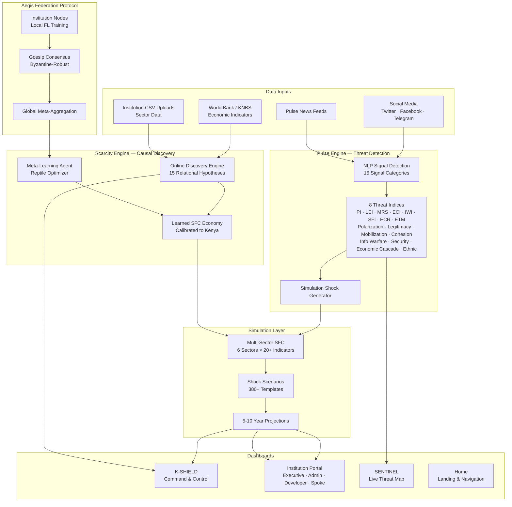

# K-Scarcity — Strategic National Economic & Threat Intelligence Platform

**An AI-powered early-warning and decision-support system for national economic stability.**

K-Scarcity fuses economic indicators, social media signals, and critical infrastructure data into a unified command layer. It learns causal relationships from real data, runs forward simulations of economic stress, surfaces threat intelligence from social signals, and delivers actionable briefings to institutional decision-makers — all through a federated, privacy-preserving architecture.

---

## System at a Glance


```mermaid
flowchart TD
    subgraph Inputs["Data Inputs"]
        A1[Social Media\nTwitter · Facebook · Telegram]
        A2[World Bank / KNBS\nEconomic Indicators]
        A3[Institution CSV Uploads\nSector Data]
        A4[Pulse News Feeds]
    end

    subgraph Pulse["Pulse Engine — Threat Detection"]
        B1[NLP Signal Detection\n15 Signal Categories]
        B2[8 Threat Indices\nPI · LEI · MRS · ECI · IWI · SFI · ECR · ETM\nPolarization · Legitimacy · Mobilization · Cohesion\nInfo Warfare · Security · Economic Cascade · Ethnic]
        B3[Simulation Shock Generator]
    end

    subgraph Scarcity["Scarcity Engine — Causal Discovery"]
        C1[Online Discovery Engine\n15 Relational Hypotheses]
        C2[Learned SFC Economy\nCalibrated to Kenya]
        C3[Meta-Learning Agent\nReptile Optimizer]
    end

    subgraph Simulation["Simulation Layer"]
        D1[Multi-Sector SFC\n6 Sectors × 20+ Indicators]
        D2[Shock Scenarios\n380+ Templates]
        D3[5-10 Year Projections]
    end

    subgraph Federation["Aegis Federation Protocol"]
        E1[Institution Nodes\nLocal FL Training]
        E2[Gossip Consensus\nByzantine-Robust]
        E3[Global Meta-Aggregation]
    end

    subgraph Dashboards["Dashboards"]
        F1[K-SHIELD\nCommand & Control]
        F2[Institution Portal\nExecutive · Admin · Developer · Spoke]
        F3[SENTINEL\nLive Threat Map]
        F4[Home\nLanding & Navigation]
    end

    A1 --> B1
    A4 --> B1
    B1 --> B2
    B2 --> B3
    B3 --> D1

    A2 --> C1
    A3 --> C1
    C1 --> C2
    C2 --> D1
    C3 --> C2

    D1 --> D2
    D2 --> D3
    D3 --> F1
    D3 --> F2

    E1 --> E2
    E2 --> E3
    E3 --> C3

    B2 --> F3
    D3 --> F2
    C1 --> F1
```

---

## Dashboards

### K-SHIELD — Command & Control
The analytical core. Four sub-modules:

| Module | What It Does |
|--------|-------------|
| **Causal Relationships** | Force-directed graph of discovered economic causal chains, Granger tests, confidence rankings |
| **Policy Terrain** | 3D stability landscape (inflation × unemployment → instability), current position marker |
| **Simulations** | Full SFC runs across 6 sectors, shock designer, scenario library, 4D state cube |
| **Policy Impact** | Public sentiment on active policies, scarcity vector tracking, social cohesion metrics |

```
streamlit run kshiked/ui/kshield/page.py --server.port 8505
```

### Institution Portal — Executive · Admin · Developer · Spoke
Multi-role institutional dashboard with:

- **Executive Dashboard** — National briefing, threat intelligence, sector reports, command & control, policy simulator, collaboration room
- **Admin Governance Console** — Pending institution approvals, audit logs, topology injection, security lattice
- **Developer Dashboard** — Technical metrics, model quality, causal adapter inspection
- **Local (Spoke) Dashboard** — County-level analytics, localized cost-of-delay projections
- **Collaboration Room** — Cross-institution secure messaging and shared analysis
- **FL Dashboard** — Federated learning round management, model registry

```
streamlit run kshiked/ui/institution/page.py --server.port 8506
```

### SENTINEL — Live Threat Command Center
Real-time operational dashboard:
- Live threat map of Kenya (county-level)
- Multi-node federation gossip topology
- Policy chat (natural-language recommendations)
- Causal simulation interactive testing
- Signal analysis deep-dive
- Escalation management

```
streamlit run kshiked/ui/sentinel_dashboard.py --server.port 8507
```

---

## Core Modules

### 1. Pulse Engine (`kshiked/pulse/`)
Real-time social media threat detection pipeline.

**Signal Categories (15 total):**
- Distress signals (food/water scarcity, healthcare access collapse)
- Anger signals (directed rage, dehumanization language)
- Institutional signals (legitimacy rejection, authority dismissal)
- Identity signals (ethno-regional framing)
- Information warfare (rumor velocity, conspiracy spreading)

**8 Computed Threat Indices:**

| Index | Description |
|-------|-------------|
| **PI** — Polarization Index | Group division, extremism language, bond fracture |
| **LEI** — Legitimacy Erosion | Authority rejection trajectory |
| **MRS** — Mobilization Readiness | Protest and violence risk |
| **ECI** — Elite Cohesion | Leadership fracture signals |
| **IWI** — Information Warfare | Misinformation intensity |
| **SFI** — Security Friction | Stability erosion signals |
| **ECR** — Economic Cascade Risk | Shock propagation probability |
| **ETM** — Ethnic Tension Matrix | Kenya-specific 12-group tension tracking |

**Shock Mapping:** Each index above threshold triggers economic shocks (GDP, inflation, trade, confidence, currency) that feed directly into the simulation engine.

---

### 2. Scarcity Engine (`scarcity/`)
Industrial-grade online machine learning infrastructure.

**Role: relationship discovery, not forecasting.** Scarcity's output is a knowledge graph
of discovered causal/correlational relationships among economic indicators. This graph is
then handed to downstream forecasters (Prophet, ARIMA) as structured prior knowledge —
Scarcity does not forecast directly. This architecture separates discovery from prediction,
letting each component do what it does best.

**15 Relational Hypotheses tested continuously:**
Causal (Granger), Correlational (Pearson), Temporal (VAR-p), Functional (Polynomial), Equilibrium (Mean-Reverting), Compositional (Sum Constraints), Competitive (Trade-off), Synergistic (Interaction), Probabilistic (Distribution Shift), Structural (Hierarchical), Mediating (Baron-Kenny), Moderating (Conditional), Graph (Network), Similarity (Clustering), Logical (Boolean Rules).

All 15 types are active in `small_dataset_mode=True` (annual macro series, N=20–50),
including sparse types (compositional, equilibrium, mediating, moderating) that require
pool capacity ≥ 2000 and `kill_threshold=0.0` to survive short time-series without being
silently pruned.

**Federation multiplies discovery power:** Pooling Kenya + Tanzania + Uganda (3 × 34 years
= ~102 effective observations) gives Granger tests 3× more statistical power. The federated
graph discovers 198 edges (vs 114 single-country), 13 KNOWN economic relationships (vs 0),
and mean confidence rises from 0.574 to 0.735. GDP graph coverage rises from 32% to 100%
of test years. PROPHET+SCARCITY (federated) achieves MAE=1.7873 on Kenya GDP growth vs
plain Prophet MAE=1.7947 — a consistent marginal improvement driven by structured parent
knowledge available in every forecast year. Graph-informed models do not improve inflation
forecasting (inflation is driven by its own momentum at annual frequency on short series).

**Key innovations:**
- Vectorized Batch RLS (`numpy.einsum`) — thousands of equations in O(1) Python overhead
- Page-Hinkley concept drift detection — regime shift alerts
- CountSketch + Tensor Sketch — high-speed dimensionality reduction
- Counterfactual Jacobian perturbation — "what-if" causal analysis
- Multi-hop causal BFS — discovers indirect chains (A→B→C)
- Graph-informed forecasting handoff — top-K parents (by confidence) passed to Prophet/ARIMA with lag-1 to prevent future leakage

---

### 3. Simulation Layer (`kshiked/simulation/`)
Multi-sector Stock-Flow Consistent (SFC) macroeconomic engine.

In addition to the dashboard-facing simulation layer, the core package now includes a typed, modular multi-sector engine in `scarcity/simulation/sfc_engine.py` with dedicated behavioral blocks (`production`, `labor_market`, `price_system`, `households`, `government`, `monetary`, `foreign`, `banking`) and residual accounting checks.

See `documentation/SIMULATION_ENGINE.md` for the full architecture and API details.

**6 Simulated Sectors:** Economics/Finance, Healthcare, Environment/Water, Social Cohesion, Education/Labor, Security

**Kenya 2022 Calibrated Baselines (KNBS/World Bank):**
- GDP growth 5.3%, Inflation 7.6%, Unemployment 5.5%
- Healthcare capacity 72%, Vaccination coverage 68%
- Water access 62%, Food security 68%
- Poverty headcount 36.5%, Gini 38.6%
- Stability index 61%, Institutional trust 42%

**Shock Templates:** 380+ parameterized templates across all sectors (drought, cholera, insurgency, fiscal shock, FX crisis, crop failure, etc.)

**Execution Modes:**
- `SINGLE_SECTOR` — deep-dive with spillover hints
- `MULTI_SECTOR` — cascading + simultaneous + weighted
- `FULL_SIMULATION` — all 6 sectors unlimited stacking

---

### 4. Scarcity Bridge (`kshiked/core/scarcity_bridge.py`)
Universal adapter connecting K-SHIELD to the Scarcity Engine.

```python
bridge = ScarcityBridge()
bridge.train("data/kenya_world_bank.csv")      # 306+ causal hypotheses
economy = bridge.create_learned_economy()       # SFC with discovered relationships
relationships = bridge.get_top_relationships(10)
confidence = bridge.get_confidence_map()
score = bridge.validate()
```

---

### 5. Aegis Federation Protocol (`kshiked/federation/`)
Distributed federated learning for multi-institution collaboration without raw data sharing.

**Architecture:**
```
Institution Node A ──> Local Training ──> Q8 Quantized Update
Institution Node B ──> Local Training ──> Q8 Quantized Update
                                            ↓
                              Global Meta-Aggregation
                              (Trimmed-Mean / Element-wise Median)
                                            ↓
                              Updated Global Prior (Reptile Optimizer)
                                            ↓
                              ←── Broadcast to all nodes
```

**Security properties:**
- Pairwise HKDF-SHA256 masking (Bonawitz-style secure aggregation)
- Differential Privacy (ε-δ Gaussian noise)
- Byzantine defense: Krum + Multi-Krum + Bulyan
- Trust scoring (Agreement 60% / Compliance 30% / Impact 10%)
- Security lattice clearance levels: UNCLASSIFIED → RESTRICTED → SECRET → TOP_SECRET

---

### 6. Cost of Delay Engine (`kshiked/ui/institution/backend/analytics_engine.py`)
Decision-support module quantifying the cost of inaction.

**Three output values (KES billions):**
- **Do Nothing Loss** — compounding economic damage if no action taken
- **Act Early Loss** — cost of early intervention
- **Price of Being Late** — marginal cost of delayed response

The delay model blends linear, staged, and exponential penalties to reflect realistic compounding risk. All values are displayed as whole-number KES billions for executive audiences.

---

### 7. Report Export (`kshiked/ui/institution/unified_report_export.py`)
Unified export across all institution dashboards (Executive, Admin, Developer, Spoke).

Each export produces a `.zip` containing:
- `report_summary.txt` — plain-language narrative for non-technical audiences
- `report_payload.json` — structured technical appendix
- `metrics.csv` — headline indicator values
- Optional table CSV attachments

PDF export is the primary format with enriched instant-analysis interpretation.

---

## Quick Start

### Installation

```bash
git clone https://github.com/Omega-Labs/kshiked.git
cd kshiked

# Create virtual environment
python -m venv .venv

# Windows
.\.venv\Scripts\activate
# Linux/Mac
source .venv/bin/activate

# Install scarcity engine (editable)
pip install -e pypi/

# Install dashboard dependencies
pip install streamlit plotly pandas numpy cryptography torch
```

### Run Dashboards

```bash
# Institution Portal
streamlit run kshiked/ui/institution/page.py --server.port 8506

# K-SHIELD Command & Control
streamlit run kshiked/ui/kshield/page.py --server.port 8505

# SENTINEL Threat Dashboard
streamlit run kshiked/ui/sentinel_dashboard.py --server.port 8507
```

### Run Tests

```bash
pytest kshiked/tests/ -v
```

---

## Institution Onboarding

1. Navigate to the Institution Portal (`/institution`)
2. Select your sector (Finance, Healthcare, Security, Agriculture, Government)
3. Enter sector invite code (set via environment variable, e.g. `KSCARCITY_INVITE_FINANCE`)
4. Submit registration → awaits Admin approval
5. Admin reviews in the Admin Governance Console → approves → node provisioned
6. Institution uploads weekly CSV data → triggers federated learning round
7. Results flow into shared causal model → improves projections for all nodes

---

## DRG Assurance Levels

The Dynamic Resource Governor (DRG) assigns an assurance level to all projections:

| Level | Condition | Meaning |
|-------|-----------|---------|
| **HIGH** | Confidence ≥ 0.85, recent data | Projection reliable for policy decisions |
| **MEDIUM** | Confidence 0.65–0.85 | Directionally correct, quantitative uncertainty |
| **LOW** | Confidence < 0.65 or stale data | Indicative only, manual review recommended |
| **FALLBACK** | Discovery failed | Uses hardcoded SFC baselines |

---

## Changelog (Recent)

| Commit | Feature |
|--------|---------|
| *(2026-05-21)* | Computational cost comparison (§56) — XGBoost+Scarcity amortized 24× ARIMA (554ms/target vs 23ms), not 224× as per-call measurement shows; discovery dominates (99% of cost); Prophet unjustified at 17× for annual macro; Chronos 44× at inference; `benchmark/scripts/benchmark_compute_cost.py` |
| *(2026-05-21)* | Chronos-T5-tiny zero-shot on Kenya (§57) — aggregate h=1 MAE=2.22 vs ARIMA 2.15 (delta=0.07, CIs overlap — statistically indistinguishable); wins inflation_cpi (3.64 vs ARIMA 4.17, −13%); loses on unemployment/exports/imports; XGBoost+Scarcity beats Chronos on imports_gdp (2.64 vs 3.21); Chronos ~50× slower than ARIMA at inference; `benchmark/scripts/benchmark_forecasting_extended.py` |
| *(2026-05-21)* | Structural break robustness test (§55) — pre-2008 graph frozen vs rolling post-GFC; frozen graph underperforms rolling at all 3 countries (KEN frozen 2.66 vs rolling 2.45); GFC invalidated most pre-2008 edges; ARIMA beats both graph conditions in aggregate (rolling re-discovery is essential); 2 KEN targets (current_account, real_interest_rate) have stable cross-regime structure; `benchmark/scripts/benchmark_structural_break.py` |
| *(2026-05-21)* | Synthetic N×SNR sweep (§54) — 6×4 grid of (N, SNR) conditions, 10 seeds each; graph-conditioning HELPS at N=50 (real-data regime) at ALL SNR levels; HURTS at N=100–200 with SNR=1; NEUTRAL at N≥500; discovery F1=0.95–1.00 throughout; theoretical justification for scarcity engine utility at N=34; crossover at SNR=1: N≈500; no crossover for SNR≥2; `benchmark/scripts/benchmark_n_sweep.py` |
| *(2026-05-21)* | 7-country expansion (§53) — RWA, ETH, MOZ, ZMB standalone backtests (9 methods × 4 horizons × 24 cutoffs each); imports_gdp and govt_consumption benefit from federation in every country; Prophet catastrophic on ZMB (7.22 vs Persistence 2.48, 2.9×); ETH (50.9% missing) limits graph formation; exports_gdp federation country-specific (helps RWA/ETH, hurts MOZ/ZMB due to asymmetric trade linkages); `benchmark/scripts/benchmark_country_standalone.py` |
| *(2026-05-21)* | TZA and UGA standalone rolling-origin backtests (§52) — 9 methods × 4 horizons × 24 cutoffs per country; TZA aggregate h=1 XgS MAE=1.645 (most predictable, ARIMA dominates h=1–3); UGA aggregate h=1 XgS MAE=2.375 (LightGBM+Scarcity wins h=3,5,10 — unique finding); Prophet catastrophically bad for TZA (3.14 vs ARIMA 1.35, 2.3×); real_interest_rate federation: KEN +1.71, TZA +0.40, UGA −1.355 — country-specific not universal; delta_coh routing cannot transfer across countries without recomputing; `benchmark/scripts/benchmark_country_standalone.py` |
| *(2026-05-21)* | delta_coh Claim 4 full validation — all 10 targets at h=1; XGBoost+Scarcity single vs federated rolling-origin backtest (24 cutoffs); Spearman rho(delta_coh, actual_h1_delta)=+0.503 (p=0.138), 8/10 direction correct (80%); two misses: current_account (+0.52 actual, NO_FED predicted) and broad_money (+0.66 actual, NO_FED predicted) benefit from federation via graph-sparsity rescue at early cutoffs; Claim 4 downgraded from "fully predictable (rho=1.0)" to "moderate evidence (rho=+0.5)"; §51 added to BENCHMARK_FINDINGS.md; `benchmark/scripts/benchmark_federation_delta.py` |
| *(2026-05-15)* | Federation routing via cross-country parent coherence diagnostic — `delta_coh = f_coh − s_coh` predicts federation benefit direction for all 3 validated targets (3/3, Spearman rho=+1.000 on 3-point validation set; see §51 for full 10-target result); routing rule: USE_FED when federated parents are more coherent across countries than single-country parents; real_interest_rate helped by federation because single-country parents (broad_money coh=0.17, exports_gdp coh=0.00) are KEN-specific noise that TZA/UGA correctly reject; inflation hurt because federation removes high-coherence parents (broad_money coh=0.93) and replaces with 10-parent diluted set; 2 of 10 targets route to USE_FED (gdp_growth, real_interest_rate); §47.8 attribution to monetary transmission channels refuted — broad_money is REMOVED by federation; `benchmark/scripts/benchmark_federation_diagnostic.py` |
| *(2026-05-15)* | BVAR Minnesota prior + Chronos zero-shot + Bootstrap CIs — 8,100 records (10 targets × 4 horizons × 24 cutoffs, KEN-single); BVAR h=1 MAE=2.87 [2.44, 3.38] vs ARIMA 2.11 [1.77, 2.49]: delta +0.76, CIs overlap (not significant at N_test=24); BVAR catastrophically unstable h>1: h=3=6.27, h=5=11.88, h=10=**41.19** [33.10, 50.17] — 9× ARIMA, non-overlapping CIs confirmed; h=1 winner per target: Persistence (4/10: inflation, current_account, broad_money, govt_consumption), ARIMA (4/10: unemployment, exports_gdp, real_interest_rate, private_credit), XGBoost+Scarcity (1/10: imports_gdp), Prophet (1/10: gdp_growth); only statistically significant h=1 difference: ARIMA vs LightGBM (non-overlapping CIs — LightGBM significantly worse); Chronos-T5 N/A (HuggingFace CDN blocked); artifact: `artifacts/benchmark_extended/results.csv`; `benchmark/scripts/benchmark_forecasting_extended.py` |
| *(2026-05-15)* | Per-parent causal ablation (§48.8) — reconstructed DoWhy vote decisions for all 17 rolling-origin cutoffs for exports_gdp (+1.009 hurt) and govt_consumption (−0.155 improved); 86% of filtered parents are predictively useful (Granger R²≥0.05) but fail DoWhy's causal vote — dominant failure mode is proxy-predictor problem (confounded/shared-trend correlation, not direct causation); exports_gdp filtered parents: electricity_access (R²=0.562, sig_rate=0.17) and inflation_cpi (R²=0.439, sig_rate=0.11) — both causally borderline proxies; govt_consumption retains only life_expectancy (R²=0.689, sig_rate=0.89) — one dominant predictor outperforms five noisy proxies at N<34; 0% real-but-unidentified (zero DoWhy identification failures); `benchmark/scripts/benchmark_causal_ablation.py` |
| *(2026-05-14)* | Causal identification benchmark — DoWhy 7-estimand (ATE/ATT/ATC/CATE/LATE/NDE/NIE) majority-vote filter on Scarcity-discovered parents; 9,720 records; ATE/ATT/ATC are effectively one vote at N<35 (100% agreement); CATE diverges for real_interest_rate (46.7% vs 23.5% ATE); Prophet+Causal wins at long horizons (−0.118 at h=5); XGBoost+Causal worse than +Graph at all horizons (spurious-but-predictive parents); LATE/MEDIATION inactive on 19-variable Kenya graph; retention 36.7%–100% across targets; `benchmark/scripts/benchmark_forecasting_causal.py` |
| *(2026-05-14)* | Multi-target multi-horizon forecasting — 10 targets × h=1,3,5,10 × 9 methods; Prophet degrades catastrophically for inflation (MAE 4.92→15.13 at h=10, +207%); ARIMA beats Prophet on aggregate at short horizons; LightGBM has flattest degradation (+0.38 vs Prophet +2.01); graph selection helps at h=1 but hurts at h=5+ as structure shifts; XGBoost+Scarcity wins 6-7/10 targets at every horizon; `benchmark/scripts/benchmark_forecasting_horizons.py` |
| *(2026-05-14)* | Downstream forecasting comparison — Prophet (data-scarce reference) vs XGBoost+lag / LightGBM+lag / TFT-lite, blind and Scarcity-graph-conditioned; 9 methods × 2 conditions (single-country + federated); XGBoost+Scarcity beats Prophet for inflation (MAE=4.14 vs 4.92, −17%); graph feature selection reduces 18→3–5 parent features preventing overfit at N_train=10; Prophet dominates GDP (MAE=1.82); `benchmark/scripts/benchmark_forecasting_models.py` |
| *(2026-05-14)* | Federated anomaly detection (KEN+TZA+UGA, N_eff=102) — GraphResiduals now catches TYPE_2 economic relationship breaks (exports_gdp→gdp_growth) that Z-score cannot; +0.020 F1 lift over single-country; Z-score and GraphResiduals shown to be complementary detectors; `benchmark/scripts/benchmark_anomaly_real_federated.py` |
| *(2026-05-14)* | Real-data anomaly detection benchmark (N=34 Kenya) — Z-score wins (F1=0.444); GraphResiduals hurts at N=34 (F1=0.191, 5× FPR); break-even for graph-conditioning benefit is 200–300 observations; RRCF catastrophically miscalibrated (FPR=70%) at small windows; `benchmark/scripts/benchmark_anomaly_real.py` |
| *(2026-05-14)* | Graph-conditioned anomaly detection benchmark (synthetic N=300) — GraphResiduals F1=0.545 vs production RRCF F1=0.029, Z-score F1=0.444; catches structural decoupling anomalies (TYPE_2 rel-break) invisible to all blind detectors; RRCF threshold miscalibrated for static windows; discovery quality degrades gracefully (approx graph = oracle F1); `benchmark/evaluation/anomaly_detection.py` + `benchmark/scripts/benchmark_anomaly.py` |
| *(2026-05-14)* | East Africa federation benchmark — all 15 hypothesis types in pool (KEN+TZA+UGA); graph-informed Prophet/ARIMA; PROPHET+SCARCITY federated MAE=1.7873 vs Prophet 1.7947 on Kenya GDP (graph in 100% of years); multi-variable graph extractor fix; per-model parent budgets |
| `26f9a39` | PDF export as primary format with enriched instant-analysis interpretation |
| `cc16176` | Hybrid delay costing + unified dashboard report export |
| `2124399` | DRG-backed assurance explainability |
| `73fdd09` | Unified institution sidebar, typography polish |
| `b291ddf` | Admin data schemas and structured project tracking |
| `c60ad39` | Sector Reports tab — all 7 sectors always visible |
| `f70726b` | Full cross-sectoral demo seeder v2 (7 sectors, 22 spokes) |
| `fb09444` | Kenya cholera outbreak synthetic data generator |
| `97aaa80` | Event-driven federated learning with WebSocket transport |
| `3d8b2aa` | Human-readable plain-language narratives on all dashboard levels |
| `eea9b31` | 5 executive analytics pillars (SO WHAT, COMPARED TO WHAT, WHERE EXACTLY, WHAT SHOULD I DO, DID IT WORK) |
| `869bba8` | Industrial RRCF anomaly detection + Bayes VARX forecasting + dual DRG |
| `55c8c48` | Synthetic stress test engine |

---

## License

Apache License 2.0 — see [LICENSE](LICENSE).

## Team

**Omega Labs** — Lead Developer  
[omegamakena.co.ke](https://omegamakena.co.ke/)
