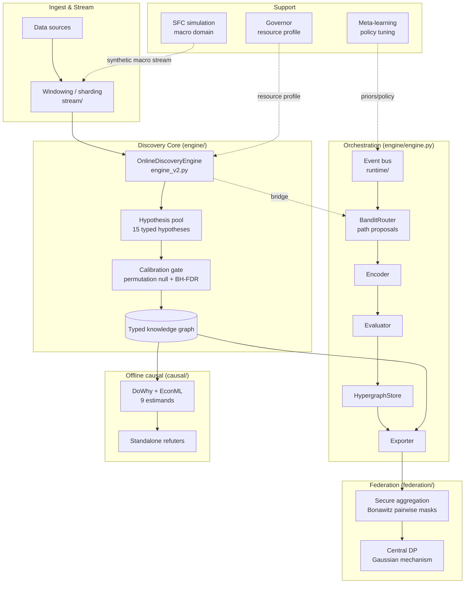
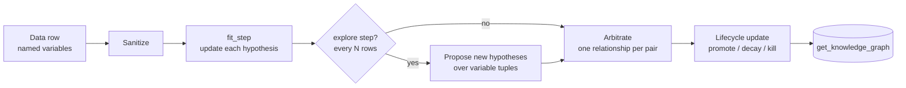
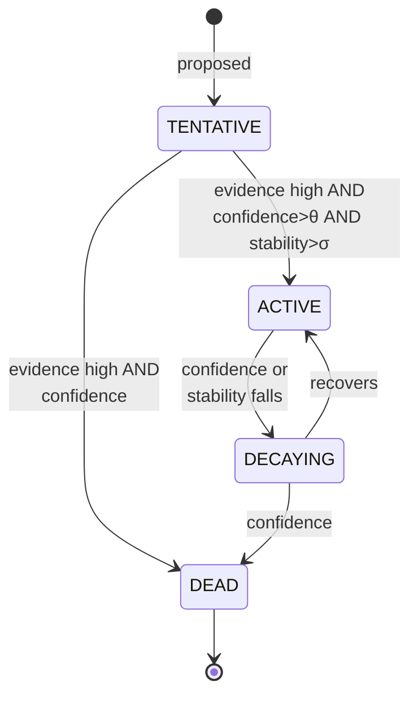
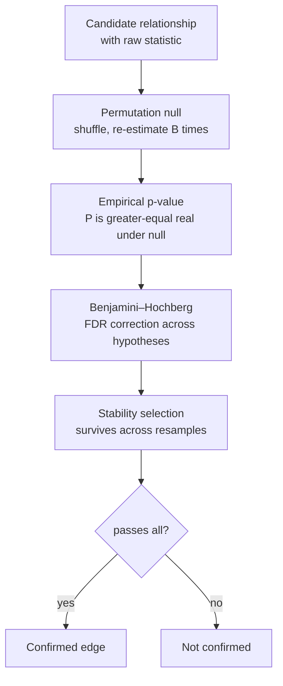
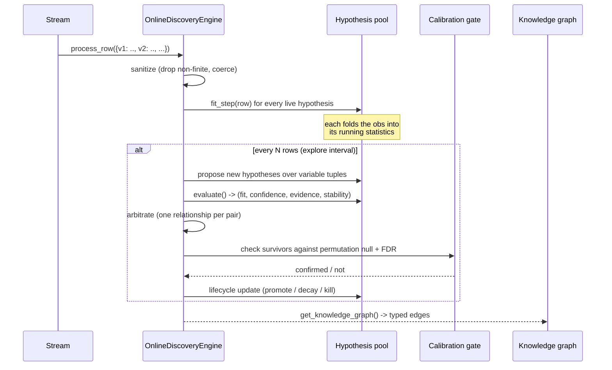
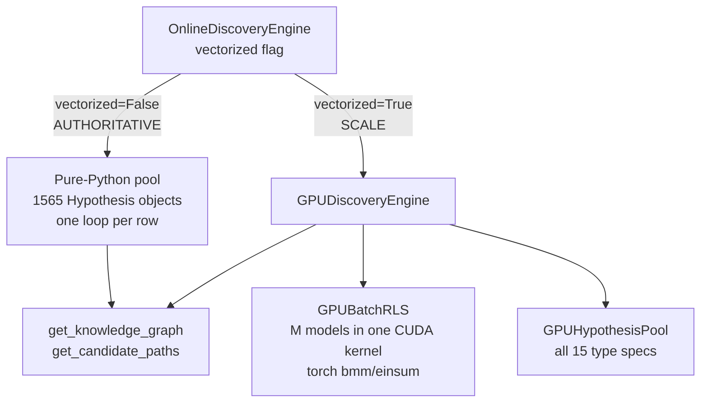
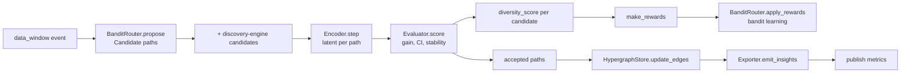
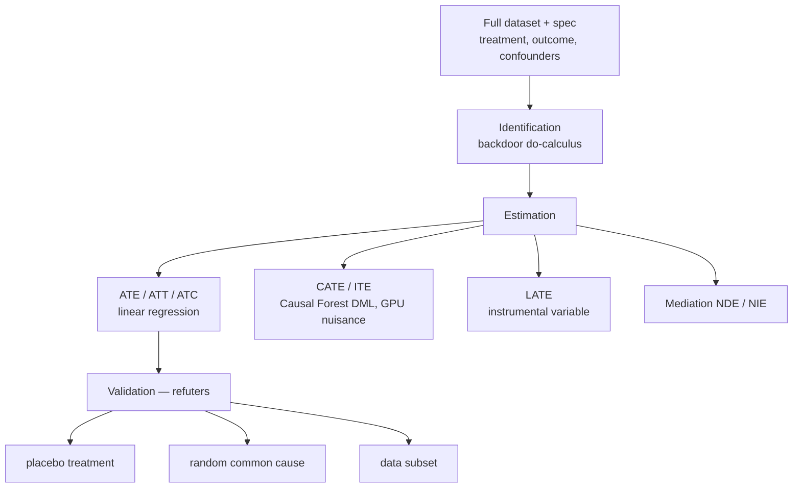
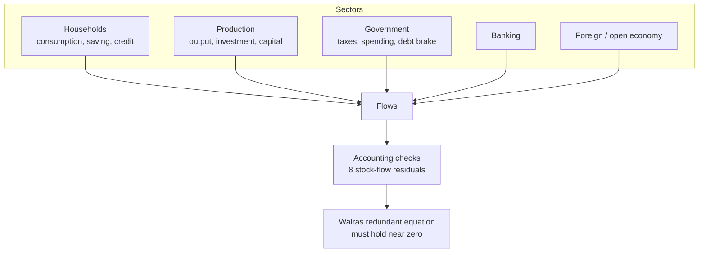
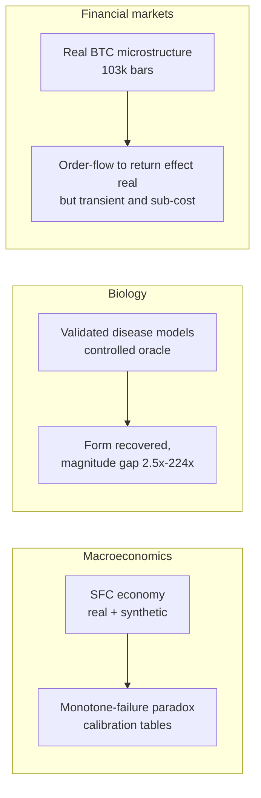

# Scarcity — System Architecture

A complete, illustrated walkthrough of the Scarcity framework: what it is, how it
is put together, the logic of each subsystem, and the path a single observation
takes from raw input to a confirmed, typed relationship in the knowledge graph.

This is the map for a large system (~40,000 lines across eleven subpackages).
Read Part I and Part II for the whole picture; the later parts drill into each
subsystem. Companion docs: [ARCHITECTURE](ARCHITECTURE.md),
[CONFIG_REFERENCE](CONFIG_REFERENCE.md), [BENCHMARK](BENCHMARK.md),
[HARDENING_SUMMARY](HARDENING_SUMMARY.md).

## Contents

1. [What Scarcity is](#1-what-scarcity-is)
2. [System-level architecture](#2-system-level-architecture)
3. [The discovery engine — the heart](#3-the-discovery-engine)
4. [The fifteen relationship types](#4-the-fifteen-relationship-types)
5. [The hypothesis lifecycle and the calibration gate](#5-the-hypothesis-lifecycle-and-the-calibration-gate)
6. [Data flow — one row through the engine](#6-data-flow-one-row-through-the-engine)
7. [The two backends — CPU and GPU](#7-the-two-backends-cpu-and-gpu)
8. [The orchestration layer](#8-the-orchestration-layer)
9. [The offline causal arm](#9-the-offline-causal-arm)
10. [Federation](#10-federation)
11. [The simulation layer](#11-the-simulation-layer)
12. [Meta-learning, governor, stream, FMI](#12-supporting-subsystems)
13. [The three evidence domains](#13-the-three-evidence-domains)
14. [Configuration](#14-configuration)
15. [Module map](#15-module-map)
16. [Glossary](#16-glossary)

---

## 1. What Scarcity is

Scarcity is an **online relationship-discovery engine**. It reads a stream of
observations — rows of named variables — and continuously maintains a set of
*hypotheses*, each proposing that two or more variables stand in one of **fifteen
typed relationships** (causal, correlational, mediating, equilibrium, and so on).
A hypothesis earns its place only by surviving evidence over time and passing a
statistical calibration gate; hypotheses that stop predicting are demoted and
eventually discarded. The surviving hypotheses form a **typed knowledge graph** —
the system's current understanding of how the variables relate.

The design intent, stated once so the rest makes sense:

- **Typed, not just "an edge".** A relationship is not merely "A and B are
  related" — it is *how* they are related (A causes B, A and B are substitutes, A
  mediates B→C). Each type carries its own estimator.
- **Online and survival-based.** Hypotheses are born, proven, decay, and die as
  the stream continues; the engine never stops learning and never trusts a
  finding that cannot repeatedly re-earn confidence.
- **Calibrated.** A raw statistic is not enough. Every finding is checked against
  a permutation null with false-discovery-rate control, so the graph's
  false-positive rate is controlled at the system level, not per-hypothesis.
- **Backend-agnostic.** A pure-Python path is the authoritative reference; a
  batched GPU path computes the same typed structure at scale. Both produce the
  same knowledge-graph interface.

The theory behind the framework — *Organizational Identity Theory for Dynamic
Data* — holds that a system's identity is the orbit of its coupling structure
under a group of admissible transformations, and that **form (which couplings
exist) is more recoverable than magnitude (how strong they are)**, especially
under scarcity of data or resources. Scarcity the engine is the instrument that
recovers that form. See the preprint for the theory; this document is about the
machine.

---

## 2. System-level architecture

At the top level, Scarcity is a set of cooperating subsystems around a central
discovery engine. Data enters as a stream, is encoded and evaluated, and confirmed
relationships are exported; a governor watches resources, a meta-learner tunes
policy, and a federation layer lets many instances learn together without sharing
raw data.



**Reading the diagram.** The *discovery core* is the heart: it turns a stream into
a typed knowledge graph. The *orchestration layer* is an event-driven wrapper that
proposes candidate paths (a bandit), encodes and evaluates them, and persists
results — it is how the engine runs as a live service. The *offline causal arm*
takes the discovered graph and estimates effect *magnitudes* with do-calculus. The
*federation layer* lets many nodes aggregate what they learn under cryptographic
privacy. The *support* subsystems (governor, meta-learning, simulation) tune,
constrain, and feed the core.

The two most important facts about the whole system:

1. **The discovery engine has two backends.** `vectorized=False` (pure Python) is
   the authoritative reference; `vectorized=True` (GPU/torch, batched) computes the
   same typed structure at scale. See [Part 7](#7-the-two-backends-cpu-and-gpu).
2. **Online recovers form; offline recovers magnitude.** The streaming engine
   discovers *which* relationships exist and *what type* they are; the offline
   causal arm (DoWhy/EconML) then quantifies *how strong* a specific effect is.

---

## 3. The discovery engine

The discovery engine (`engine/engine_v2.py`, `OnlineDiscoveryEngine`) is the
component every other part orbits. It owns a **hypothesis pool** and drives it
through the stream.



Each hypothesis is a small stateful object (or, on GPU, a row in a batched tensor)
that:

- **`fit_step(row)`** — folds the new observation into its running statistics
  (regression state, buffers, counts).
- **`evaluate()`** — computes its type-specific statistic, a fit score, a
  confidence, an evidence count, and a stability score.
- **`predict_value(row)`** — optionally predicts the target, used for reward
  shaping and forecasting.

The engine periodically **arbitrates** (parsimony: at most one relationship type
per variable pair survives, the strongest), runs an **instrumental-variable pass**
for causal candidates, and applies the **lifecycle** state machine.

---

## 4. The fifteen relationship types

Every hypothesis is one of fifteen types. Each has a principled estimator on the
CPU path and a matching batched estimator on the GPU path.

| # | Type | Meaning | CPU estimator | GPU estimator |
|---|------|---------|---------------|---------------|
| 1 | **Causal** | A Granger-causes B | Granger F-test (fwd/bwd) + transfer entropy, direction by F-ratio asymmetry | lagged RLS fit |
| 2 | **Correlational** | A and B co-vary | Pearson r + t-test, distance correlation | RLS fit (R²=r²) |
| 3 | **Temporal** | A leads B at a lag | AR + cross-lag autocorrelation | lagged RLS fit |
| 4 | **Functional** | B = f(A), possibly non-linear | adjusted-R² polynomial + kernel | RLS fit (linear part) |
| 5 | **Equilibrium** | A series is mean-reverting | OU-MLE + augmented Dickey–Fuller | AR(1) φ<1 unit-root test |
| 6 | **Probabilistic** | P(B \| A) shifts with A | median-split conditional distributions | median-split, Cohen's d gated |
| 7 | **Compositional** | An accounting identity holds | identity residual within tolerance | R² ramp above 0.9 (near-exact) |
| 8 | **Competitive** | A and B are substitutes | anti-correlation + low sum-CV | significant *negative* slope |
| 9 | **Synergistic** | A·B jointly drive C | interaction F-test | interaction-coefficient significance |
| 10 | **Mediating** | A→B→C indirect path | Sobel test (Joseph-form RLS) | Sobel test from stored series |
| 11 | **Moderating** | B moderates A→C | interaction F-test | interaction-coefficient significance |
| 12 | **Graph** | non-linear coupling | mutual information (Miller–Madow) | Fourier-feature RLS fit |
| 13 | **Similarity** | variables co-move / are redundant | k-means++ + online silhouette | mean \|pairwise correlation\| |
| 14 | **Structural** | outcome differs across groups | one-way ANOVA (F, η², ICC) | ANOVA (η²/F, Fisher χ²→z) |
| 15 | **Logical** | a Boolean rule predicts C | Boolean rules + binomial test | Boolean rules, effect-size gated + Šidák |

The estimators are deliberately standard and literature-grounded. The GPU column
is validated by construction — each estimator fires on data that contains its
relationship and stays quiet on data that does not (`scarcity/tests/
test_gpu_type_estimators.py`).

---

## 5. The hypothesis lifecycle and the calibration gate

A hypothesis moves through four states. This survival machine is what keeps the
graph honest: a relationship must keep re-earning confidence or it dies.



Confidence alone is not trusted. Before a relationship is treated as real it must
pass the **calibration gate**:



The gate is the reason the system reports controlled false-positive rates. On the
synthetic oracle the engine recovers structure at **F1 = 1.00 with null FPR =
0.00**. The p-value → signal mapping is calibrated so that pure-noise data yields
`E[signal] ≈ 0.025`, i.e. the gate is calibration-safe by construction.

**Design principle learned the hard way:** a bare significance test is *uniform
under the null*, so it false-fires — worse when maximized over many hypotheses.
Type-specific estimators therefore gate on **effect size** (near zero under the
null regardless of sample size), not raw significance. This is why the GPU
estimators for probabilistic/logical/compositional/similarity gate on Cohen's d,
accuracy-above-chance, R²-near-1, and pairwise-correlation respectively.

---

## 6. Data flow — one row through the engine

Concretely, here is what happens when a single observation arrives.



The cost is bounded: `fit_step` is O(1) per hypothesis per row; the expensive
steps (evaluation, calibration) run only on the explore interval, and the pool has
a capacity so the population never grows without bound.

---

## 7. The two backends — CPU and GPU

The same engine has two interchangeable backends. This is the single most
important implementation fact.



- **Pure Python (`vectorized=False`)** is the reference. It streams
  `Hypothesis` objects one row at a time and is the path behind every published
  result. It requires no torch.
- **GPU (`vectorized=True`)** processes *all* hypotheses per row as a batched
  tensor operation (`GPUBatchRLS`, `bmm`/`einsum`), instead of looping ~1,565
  Python objects. It falls back cleanly to the CPU path when torch is absent and
  raises a clear error if `vectorized=True` is requested without torch.

**Parity.** Both backends emit the identical `get_knowledge_graph()` /
`get_candidate_paths()` interface. The GPU backend computes each type with its own
batched statistic — `GPUBatchRLS.coef_significance(j, null)` for coefficient tests
(interaction terms, unit roots), and stored-series helpers for Sobel/ANOVA — so it
discovers the same typed structure, not just a generic fit. Parity is tested in
`scarcity/tests/test_gpu_cpu_parity.py` and per-type discrimination in
`test_gpu_type_estimators.py`.

> Note: the GPU estimators are validated by construction (fire-on-signal /
> quiet-on-null). A full numerical F1 parity benchmark against the CPU oracle is
> the checkpoint before promoting `vectorized=True` to the default.

---

## 8. The orchestration layer

`engine/engine.py` (`MPIEOrchestrator`) is the event-driven service wrapper. It
subscribes to a data-window topic and runs the full propose → encode → score →
reward → persist loop for each window.



The pieces:

- **BanditRouter** (`bandit_router.py`) — a multi-armed bandit (Thompson / UCB /
  ε-greedy) that proposes which candidate paths to evaluate, generating directed
  variable-pair `Candidate` objects from the window schema, scoring each by its
  arm, and learning from rewards.
- **Encoder** (`encoder.py`) — projects each candidate path to a latent via
  attention/pooling/sketch operators; reports real telemetry (per-path cost,
  saturation).
- **Evaluator** (`evaluator.py`) — bootstraps a predictive gain (R²) with a
  confidence interval and a stability score, and decides acceptance.
- **HypergraphStore** (`store.py`) — the persistent typed-edge store.
- **Exporter** (`exporter.py`) — publishes confirmed insights on the event bus.

The orchestrator can be bridged to the `OnlineDiscoveryEngine` so that
statistically discovered relationships are injected directly into the bandit's
proposal pool — closing the loop between the two engines.

---

## 9. The offline causal arm

The streaming engine recovers *form*. To recover *magnitude* — the size of a
specific causal effect — Scarcity has an offline arm (`causal/`) built on DoWhy
(do-calculus identification) and EconML (heterogeneous effects).



The nine estimands run in one parallel call. The **refutation suite is
standalone** — reimplemented on backdoor/FWL adjustment rather than DoWhy's
`refute_estimate` (whose signature drift broke across releases), so it is
version-independent: placebo (permute treatment, effect collapses),
random-common-cause (an irrelevant confounder does not move the effect), and
data-subset (the effect is stable across subsets). Significance uses a fast
permutation placebo whose FWL estimate equals the do-calculus linear ATE.

---

## 10. Federation

Many Scarcity nodes can learn together without sharing raw data. The federation
layer (`federation/`) aggregates model updates under cryptographic privacy.

```mermaid
sequenceDiagram
    participant C1 as Client A
    participant C2 as Client B
    participant S as Coordinator

    Note over C1,C2: per round: ephemeral X25519 keys,<br/>signed with Ed25519 identity
    C1->>S: signed ephemeral public key
    C2->>S: signed ephemeral public key
    S-->>C1: peer keys (verified)
    S-->>C2: peer keys (verified)
    Note over C1,C2: derive pairwise masks via DH + HKDF;<br/>masks are antisymmetric (cancel in the sum)
    C1->>S: update + masks
    C2->>S: update + masks
    Note over S: sum reveals only the aggregate<br/>(masks cancel); central DP noise added
    S-->>S: Gaussian mechanism: sigma = sensitivity*sqrt(2 ln(1.25/delta))/eps
```

- **Secure aggregation** (`secure_aggregation.py`) is a real Bonawitz-style
  pairwise-mask protocol (Ed25519 identity signing, X25519 ephemeral DH,
  HKDF-derived masks, dropout recovery). The masks are antisymmetric so they
  cancel exactly when summed — the coordinator sees only the aggregate. Selected
  with `secure_aggregation_mode="crypto"`; a labelled in-process simulation is the
  default fallback (identical numerical aggregate, no cryptographic guarantee).
- **Central differential privacy** (`layers.py`, `CentralDPMechanism`) adds
  calibrated Gaussian noise to the aggregate, with the L2 sensitivity updated per
  round and the budget tracked by a privacy accountant (basic ε,δ composition —
  conservative).

---

## 11. The simulation layer

The macro evidence domain is generated by a **stock-flow-consistent (SFC)**
macroeconomic model (`simulation/`), calibrated to Kenyan national accounts (KNBS
2019). Its defining property is accounting consistency — every flow has a source
and a sink, and the sector budget constraints close.



`accounting.py` computes eight consistency residuals every quarter, including the
Walras-law redundant equation — the hallmark of a genuine Godley–Lavoie SFC model.
The class-based `SFCEconomy` (`sfc.py`) is the engine behind the macro-domain
results and produces bounded macro indicators (growth, inflation, unemployment,
debt-to-GDP).

> Implementation note: there are several SFC implementations in this package. The
> functional steady-state solver in `sfc_engine.py` is a separate path; its
> government block now includes the fiscal debt brake (the primary balance responds
> to the debt-to-GDP gap), without which government debt has no steady state.

---

## 12. Supporting subsystems

- **Meta-learning** (`meta/`) — a Reptile-style meta-optimizer and cross-domain
  memory that tune the engine's policy (exploration temperature, diversity
  weight) and warm-start priors, delivered to the core as policy-update events.
- **Governor** (`governor/`) — reads system resources (CPU, memory, GPU) and emits
  a *resource profile* that throttles or expands engine operations (number of
  paths proposed, resampling counts) in real time.
- **Stream** (`stream/`) — windowing, sharding, caching, and async replay that
  turn raw sources into the `data_window` events the engine consumes.
- **FMI** (`fmi/`) — the Federation–Meta Interface: contracts, routing, encoding,
  and telemetry that bridge federation outputs into meta-learning priors.
- **Runtime** (`runtime/`) — the event bus and telemetry that every subsystem
  communicates through.

---

## 13. The three evidence domains

The framework is demonstrated across three independent domains, each playing a
role the others cannot.



- **Macroeconomics** — a controlled-yet-real domain; the scarcity paradox appears
  as monotone forecasting failure and the calibration tables quantify it.
- **Biology** — a *controlled oracle*: known ground-truth dynamics let the
  recoverability hierarchy (form recovers, magnitude does not) be measured exactly.
- **Financial markets** — a real, fast, adversarial, priced domain. The offline
  causal arm recovers a robust order-flow → return effect (placebo p < 0.001), but
  it is transient and below transaction cost — the scarcity paradox as literal
  unexploitability. The online arm recovers the form; the offline arm the
  magnitude.

---

## 14. Configuration

Tunables live in typed config dataclasses rather than scattered literals.

- **`scarcity/config.py`** — `ENGINE_CONFIG`, the cross-cutting orchestration
  tunables (`ProposerConfig`: paths per window, candidate lags/ops, arm cap;
  `DiversityConfig`: novelty memory and weight).
- **`engine/relationship_config.py`** — per-hypothesis configs (e.g.
  `CausalConfig` with the directionality asymmetry ratio and significance level).
- **`engine/bandit_router.py` `BanditConfig`**, **`simulation/parameters.py`
  `AllParams`** (the calibrated Kenya parameters), and the **resource profile**
  from the governor.

See [CONFIG_REFERENCE](CONFIG_REFERENCE.md) for the full list.

---

## 15. Module map

| Path | Lines | Responsibility |
|------|------:|----------------|
| `engine/` | ~11,800 | Discovery core, the 15 hypotheses, both backends, orchestration, bandit, encoder, evaluator, store |
| `simulation/` | ~9,200 | Stock-flow-consistent macro model (the macro domain) |
| `federation/` | ~5,900 | Secure aggregation (real crypto), central DP, gossip, hierarchical federation |
| `synthetic/` | ~3,100 | Synthetic data generators and benchmark scenarios |
| `meta/` | ~2,600 | Meta-learning optimizer and cross-domain memory |
| `causal/` | ~1,700 | Offline do-calculus arm (DoWhy/EconML) + standalone refuters |
| `fmi/` | ~1,700 | Federation–Meta Interface |
| `stream/` | ~1,600 | Windowing, sharding, caching, replay |
| `runtime/` | ~700 | Event bus and telemetry |
| `governor/` | ~600 | Resource sensing and the resource profile |
| `analytics/` | ~200 | Terrain / analysis helpers |

Key single files: `engine/engine_v2.py` (`OnlineDiscoveryEngine`),
`engine/engine.py` (`MPIEOrchestrator`), `engine/relationships.py` +
`relationships_extended.py` (the 15 hypotheses), `engine/gpu_engine.py` +
`gpu_batch_rls.py` + `gpu_hypothesis_pool.py` (GPU backend),
`engine/discovery.py` (pool, lifecycle, FDR gate), `causal/engine.py`
(`run_causal`), `federation/secure_aggregation.py`, `simulation/sfc.py` +
`accounting.py`.

---

## 16. Glossary

- **Hypothesis** — a proposed typed relationship among variables, with running
  statistics, a lifecycle state, and a type-specific estimator.
- **Relationship type** — one of the fifteen categories a hypothesis can take.
- **Lifecycle** — the TENTATIVE → ACTIVE → DECAYING → DEAD survival state machine.
- **Calibration gate** — permutation null + Benjamini–Hochberg FDR + stability
  selection that controls the graph's false-positive rate.
- **Form vs magnitude** — *form* is which typed couplings exist (recovered
  online); *magnitude* is how strong a specific effect is (recovered offline).
- **Backend** — the pure-Python (authoritative) or GPU (batched) computation path;
  both emit the same knowledge-graph interface.
- **Candidate / path** — a proposed variable tuple (with lags and operators) that
  the orchestrator's bandit selects to evaluate.
- **Scarcity paradox** — under scarcity, form remains recoverable while magnitude
  and exploitability degrade; in markets this becomes literal unexploitability.
- **SFC** — stock-flow-consistent: a macro model whose accounting identities close
  exactly, validated by the Walras redundant equation.
- **Secure aggregation** — a protocol (Bonawitz pairwise masks) letting a
  coordinator learn only the sum of client updates, never an individual update.
